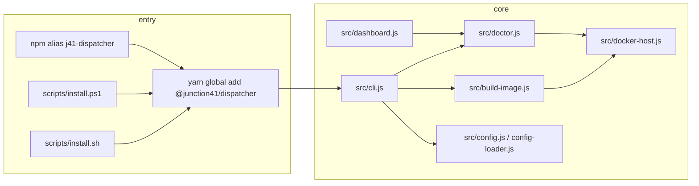
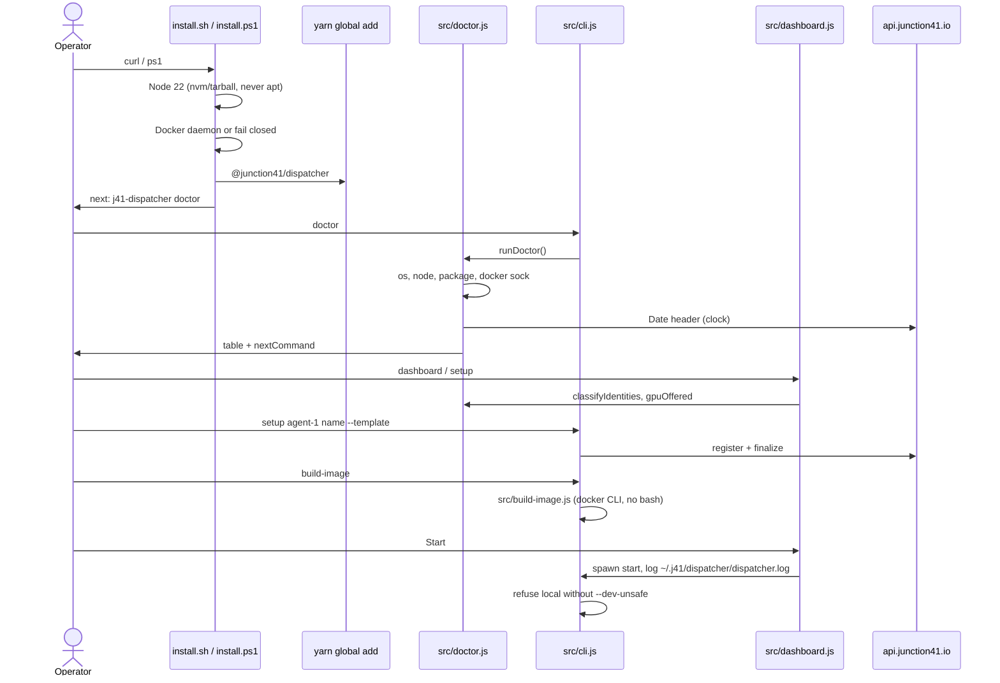

# Plan — technical architecture

Mass-use onboarding is installer + doctor + honest TUI + labour first-run.
GPU remains a Linux chapter behind the existing fail-closed host gate.

This plan picks one design and commits. Alternatives (docs-only, npm-first
without installer, Colima-as-default, weaken disk quota) are rejected in
`constitution.md`.

---

## Architecture decision

**Installer-first, npm alias as safety net, `src/doctor.js` as the only
classifier, Node-driven `build-image`, TUI as a renderer.**

Rationale:

- Stock Ubuntu has no Node 20. Docs-only leaves the two-liner dead. npm-only
  assumes a writable prefix and Node ≥20.
- Unscoped `j41-dispatcher@2.0.0` will keep biting gists even after the
  installer is perfect. Alias or delete the name everywhere, same day.
- TUI will keep teaching `N registered` and `config --runtime local` if it
  does not consume doctor in the same PR.
- `spawn('bash', …)` blocks Windows. dockerode is already a dependency.

Trade-offs accepted:

- Installer uses `get.docker.com` (curl | sh) on Linux — same class of risk
  as today, but it installs a daemon instead of silently selecting local.
- Labour `build-image` skips `gpu-jail` unless `--gpu`. Two-image “always”
  was simpler; it wasted first-run and failed on hosts that cannot jail.
- Windows first-class is Docker Desktop WSL2 only. Hyper-V-only is fail-closed
  rather than a second matrix cell.

---

## Component map



### `src/doctor.js` — single source of truth

**Path:** `src/doctor.js` (new). Tests: `test/doctor.test.js`.

**Exports:**

```js
runDoctor(opts) → Promise<DoctorReport>
formatDoctorTable(report) → string
classifyIdentities(agentsDir, { loadKeys, loadFinalize }) → IdentityRow[]
probeDocker(opts) → { cli, daemon, sock, group, errorClass }
probeClock({ fetch, now, apiUrl }) → { skewMs, ok }
```

`opts` injects `execSync`, `fs`, `os`, `fetch`, `homedir`, `env`, `now` so
unit tests never need a daemon.

**Responsibilities:** OS support (macOS 14+, win32+DD WSL2), Node ≥20, package
version (2.0.0 trap), Docker ENOENT vs EACCES vs down, sock paths, job-agent
image, clock skew vs API `Date`, runtime ≠ local, LLM configured (warn),
identity stages, fee-tank low vs empty, GPU skip on darwin/win32.

**Must not:** print secrets; write `runtime=local`; call `config --runtime local`;
duplicate `supportsStorageOpt` logic (require `docker-host.js`).

**Docker sock probe order:**

1. `process.env.DOCKER_HOST` if set
2. linux: `/var/run/docker.sock` (and WSL: same — not the Windows pipe)
3. darwin: `~/.docker/run/docker.sock`, `/var/run/docker.sock`,
   `~/.colima/default/docker.sock` (hint only)
4. win32: `//./pipe/docker_engine` via `new Docker()`; confirm Desktop WSL2
   (`docker info` OS / `docker version` server). Hyper-V-only → `os` fail.

Pass a dockerode `Docker` instance constructed with the winning socket.
Replace naive `new Docker()` at `cli.js:127` and `cli.js:8549` with
`require('./doctor').connectDocker()` (or a tiny `src/docker-connect.js`
used by both doctor and cli — prefer one helper next to doctor to avoid a
third sniffer). **Decision:** `src/docker-connect.js` exports
`resolveDockerHandle()`; `doctor.js` and `cli.js` both use it.

### `src/cli.js` — commands

Modify (do not explode the 9k-line file further than needed):

| Change | Where |
|--------|--------|
| `doctor` command | next to `status` ~6255 |
| `status` identity language | 6268–6270 |
| `getActiveJobs` error copy | 1256–1268 |
| `start` log default if spawned without TTY | optional: respect `J41_LOG_FILE` |
| `build-image` action | 4121–4166 call `src/build-image.js` |
| `new Docker()` | 127, 8549 → `resolveDockerHandle()` |

`start` local-mode gate (4320–4330) stays. TUI still cannot pass
`--dev-unsafe`.

### `src/build-image.js` — no bash requirement

Replace `spawn('bash', [script])` (`cli.js:4106`) with Node:

1. Resolve repo root from `__dirname` (already the point of
   `buildImageScriptPath`).
2. Create a temp build context (what `scripts/build-image.sh` copies into
   `.build-temp`).
3. `dockerode.buildImage` **or** `spawn('docker', ['build', '-f', …])` —
   **Decision:** spawn the `docker` CLI (exists if daemon check passed). This
   avoids streaming tar through dockerode and works with Desktop. No bash.
4. Labour default: build `j41/job-agent` only.
5. `--gpu` or `opts.gpu`: also run the jail Dockerfile.
6. Keep `scripts/build-image.sh` as a thin wrapper that calls
   `node src/cli.js build-image` so existing docs do not 404, but the CLI
   must not spawn it.

Windows: `docker` on PATH from Docker Desktop. WSL: same.

### `src/dashboard.js` — renderer

| Surface | Change |
|---------|--------|
| Header agent line 276 | identity summary from `classifyIdentities` / last `DoctorReport` |
| Header runtime | if `runtime=local`, treat as doctor fail; Start already explains |
| Status screen ~880 | prepend Doctor table from `runDoctor()` |
| Start 3898–3948 | stdio → `~/.j41/dispatcher/dispatcher.log`; mkdir 0700 |
| `resolveDispatcherLogPath` 867–877 | that path first, `/tmp/dispatcher.log` last (legacy tail only) |
| Sign up kinds 1258–1263 | hide `compute` unless `gpuOffered` |
| Fee tank EMPTY banner 293–297 | EMPTY only for `empty-*`; LOW for `low` (32 writes) |

Do not add `--dev-unsafe` to the Start spawn argv.

New menu item optional: `[Doctor]` that prints `formatDoctorTable`. Status
can absorb it — **Decision:** Status & Health hosts the doctor table; no extra
menu row (pageSize already 20).

### `scripts/install.sh`

Rewrite. Stop cloning. Algorithm:

1. Reject Darwin kernel major < 23 (macOS ≤13).
2. Node ≥20 on PATH? else nvm install 22; else Linux official tarball to
   `~/.local/node`; **delete apt/dnf/nodesource branches**.
3. yarn via `corepack enable` or `npm install -g yarn`.
4. `docker info` with sock probe (inline or `node -e` once Node exists). If
   missing: Linux `get.docker.com` + `usermod -aG docker` + tell them to
   `newgrp`. Darwin: print Docker Desktop URL and exit 1. No local runtime.
5. `yarn global add @junction41/dispatcher`.
6. Ensure `~/.local/bin` or yarn global bin on PATH.
7. Print `j41-dispatcher doctor` as next step. Do not `init -n 9`. Do not
   write `config.json` runtime local. If writing runtime at all, write
   `docker`.
8. `REPO_URL` 404 goes away because there is no clone. If a fallback archive
   is needed, use `https://github.com/autobb888/j41-sovagent-dispatcher`.

`setup.sh`: stop being a second installer. **Decision:** make `setup.sh` a
wrapper that execs `scripts/install.sh` or print “deprecated, use install.sh /
yarn global add”. Do not keep `init -n 9`.

### `scripts/install.ps1` (new)

- Require 64-bit Windows 10/11.
- Detect Docker Desktop; fail if not WSL2 backend
  (`docker version` / Desktop settings). Copy-paste: enable WSL2 + Desktop.
- Node 22: `winget install OpenJS.NodeJS.LTS` or official MSI; or nvm-windows
  if present. Never Chocolatey `nodejs` as the only path unless it is ≥20
  (do not document choco).
- `yarn global add @junction41/dispatcher`.
- Next step: `j41-dispatcher doctor`.

WSL Ubuntu users are told to run `install.sh` inside the distro if they prefer
the Linux path (equal, not second-class).

### npm alias package

New tiny package **outside** this repo or `packages/j41-dispatcher-alias/` —
**Decision:** `packages/j41-dispatcher-alias/` in this repo so versioning
stays in lockstep.

```json
{
  "name": "j41-dispatcher",
  "version": "2.36.0",
  "bin": { "j41-dispatcher": "bin.js" },
  "dependencies": { "@junction41/dispatcher": "2.36.0" }
}
```

`bin.js` re-exports the scoped bin. `postinstall` warns if a leftover 2.0.0
bin shadows PATH. Publish blocked on npm token; `npm pack` is the code gate.

If ownership fails: delete unscoped snippets everywhere (Wave 0 still merges).

### `package.json` `files`

Add at minimum:

- `docs/config.toml.example`
- `JAILBOX_PARKED.md` (README links it)
- `src/doctor.js`, `src/build-image.js`, `src/docker-connect.js` (they live
  under `src/` already)
- Wave 4: `scripts/enable-docker-disk-quota.sh` (already covered by `scripts`)

Keep `docs/spec-kit/` **out** of the tarball unless we decide operators need
it (they do not).

### `j41-secure-setup` win32 branch

In `j41-secure-setup/lib/detect-platform.js`:

- `os` union includes `'win32'`.
- `distro`: linux → os-release; darwin → `'macos'`; win32 → `'windows'`;
  WSL linux → os-release + `wsl: true` (add field).
- Stop hardcoding `'macos'` for every non-linux.
- Tests: do not assert `os` is only linux|darwin; allow win32.
- gVisor install remains linux-only (already).

Dispatcher depends on this as optional. Wave 1 can land detectPlatform before
dispatcher Wave 2 consumes `wsl`. If secure-setup publish lags, doctor still
detects WSL itself (`WSL_DISTRO_NAME`).

### Clock skew

`probeClock`: `HEAD` or `GET` `{api_url}` (from config or default), read
`Date`, compare to `Date.now()`. Fail if `abs(skew) > 30_000` ms.
Unreachable API → `warn` (do not block install on a down platform).
Copy-paste: `timedatectl set-ntp true` (linux/WSL), macOS System Settings,
WSL extra `hwclock` / `wsl --shutdown`.

### Log path

**Decision:** `~/.j41/dispatcher/dispatcher.log` (or `%USERPROFILE%\.j41\dispatcher\dispatcher.log`).
Create the directory with `0700`. Open append `0600` if the platform allows.

TUI Start stdio goes there. `resolveDispatcherLogPath` order:

1. `cfg.runtime.log_file` if we add it to config-loader (optional Wave 3)
2. `~/.j41/dispatcher/dispatcher.log` if exists
3. legacy `/tmp/dispatcher.log` if exists (read-only tail)
4. honest “logs not captured”

Do not add `runtime.log_file` to DEFAULTS unless Start writes it. Prefer the
fixed path so doctor can name it.

---

## Data flow — install → doctor → setup → start



---

## Testing strategy

| Layer | What |
|-------|------|
| Unit | `test/doctor.test.js` fixtures from `contracts/doctor.md` |
| Unit | `test/docker-connect.test.js` sock order |
| Unit | `test/build-image.test.js` spawn argv is `docker` not `bash`; labour skips jail |
| Regression | `getActiveJobs` strings: fail test if `config --runtime local` remains (`friend-boot-docs` style source scan) |
| Regression | dashboard header must not match `/Agents: \d+ registered/` |
| Regression | fee-tank 32 writes ≠ EMPTY |
| Pack | `npm pack` + scratch HOME + `node … doctor --json` |
| Wave 5 | matrix: Ubuntu 24.04 VM, macOS 14 Docker Desktop, Win11 DD WSL2; macOS 13 expected fail |

No live NVIDIA required for labour tests. GPU storage tests already live in
`test/docker-host.test.js`; add `overlayfs` driver fixture.

---

## Docs (j41-docs + README)

Wave 0 (can merge before installer):

- Node 20+, not 18+
- Two-liner with `autobb888` raw URL
- Unscoped name: alias or deleted
- `setup` not `init -n 9`
- No Verus daemon in dispatcher quickstart
- GPU chapter linked, not in first page
- Distro matrix page with verified cells only

---

## Out of scope

- Auto-reconfigure Docker storage-driver / data-root
- Minting sovdata/sovmodel at first-run
- Native Hyper-V Docker without WSL2
- Colima/OrbStack as installer defaults
- Weakening `HOME_GPU_NO_DISK_QUOTA`
- TUI `--dev-unsafe`
- Publishing wait as a code blocker (`npm pack` is the gate)
