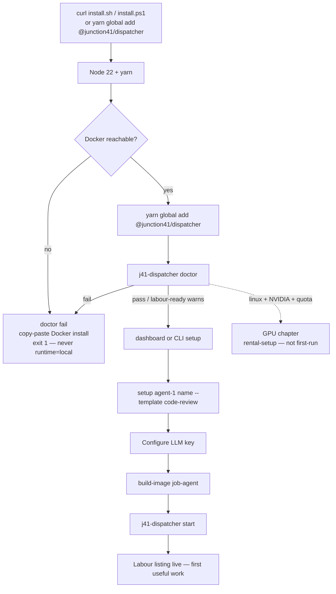

# Spec — Dispatcher mass-use onboarding

**Input:** a stranger with a laptop, no GPU, no Verus daemon, no coins.
**Output:** one labour listing that can accept a paid job.
**Non-goals:** first-run sovdata/sovmodel mint; Cat-1 GPU on Mac/Windows;
silent local runtime; docs-only fixes.

Constitution: `constitution.md`. Classifier: `data-model.md` +
`contracts/doctor.md`. Facts: `research.md`. Plan: `plan.md`.



---

## User story 1 — Stock Ubuntu 24.04 two-liner

A person on a fresh Ubuntu 24.04 desktop (or VM) with `curl` and sudo can
install Node 22 **without apt `nodejs`**, install Docker CE, put
`j41-dispatcher` on PATH, and land on `doctor` with a copy-paste next step.

**Canonical two-liner (POSIX):**

```bash
curl -fsSL https://raw.githubusercontent.com/autobb888/j41-sovagent-dispatcher/main/scripts/install.sh | bash
j41-dispatcher doctor
```

Installer does **not** clone git. It bootstraps Node 22 (nvm, else official
tarball → `~/.local/node`), yarn, Docker via `get.docker.com` if the daemon is
missing, then `yarn global add @junction41/dispatcher`. It writes nothing
with `runtime: local`. Next-step banner is `doctor` then `dashboard` / one
`setup`, never `init -n 9`.

### Acceptance

**Given** a stock Ubuntu 24.04 box with no Node and no Docker, stdin not a TTY
**When** they run the curl two-liner
**Then** Node on PATH is ≥20 (22 preferred), apt `nodejs` was not installed,
`j41-dispatcher --version` prints the scoped package version (≥ 2.36.0),
`~/.j41/dispatcher/config.json` is either absent or `runtime` is `docker`,
and the script printed `j41-dispatcher doctor` as the next step

**Given** the same box, Docker installed but the user not yet in group `docker`
**When** the installer finishes and they run `j41-dispatcher doctor`
**Then** `docker.group` is `fail` with `newgrp docker` (or log out/in) in
`copyPasteBlock`, and no line suggests `config --runtime local`

**Given** Ubuntu 24.04 where someone already `apt install nodejs` (18.19.1)
**When** the installer runs
**Then** it does not treat that Node as sufficient; it installs 22 via nvm or
tarball and puts it first on PATH for the dispatcher bin

**Given** piped `curl | bash` and Docker install declined or `get.docker.com` fails
**When** the script would previously have set `RUNTIME=local`
**Then** it exits non-zero with a Docker copy-paste block and does not write
local runtime

---

## User story 2 — npm alias (unscoped `j41-dispatcher` must not stay 2.0.0)

People paste `npm i -g j41-dispatcher` / `yarn global add j41-dispatcher`
from old gists. Today that installs frozen `2.0.0`. The unscoped name becomes
a thin alias of `@junction41/dispatcher` at the same version, or every public
snippet drops the unscoped name the same day.

### Acceptance

**Given** npm ownership of `j41-dispatcher` and a working publish token
**When** `npm view j41-dispatcher version` is run after Wave 0 publish
**Then** the version equals `@junction41/dispatcher` latest (≥ 2.36.0), the
bin is `j41-dispatcher`, and `main`/`bin` re-export the scoped package

**Given** a prefix that already has `j41-dispatcher@2.0.0`
**When** they install the alias
**Then** postinstall replaces the old bin (the EEXIST trap is handled); `j41-dispatcher --version` is not 2.0.0

**Given** npm ownership is blocked for more than the key-rotation window
**When** Wave 0 docs merge
**Then** README, installer, j41-docs, and CLAUDE.md contain **zero** unscoped
`yarn global add j41-dispatcher` / `npm i -g j41-dispatcher` lines; the only
install named is `@junction41/dispatcher`

**Given** `j41-dispatcher doctor` on a machine whose PATH bin is 2.0.0
**When** `package` check runs
**Then** status is `fail` and `nextCommand` is
`yarn global add @junction41/dispatcher`

Code gate for the alias package: `npm pack` of the alias + scratch HOME.
Publish may wait 1–2 days for a key.

---

## User story 3 — doctor CLI + TUI Doctor share one module

`src/doctor.js` classifies the machine. `j41-dispatcher doctor` prints the
table / `--json`. The TUI header, Status & Health, and Start-enablement consume
the same `DoctorReport`. No second OS sniffer in `dashboard.js`.

### Acceptance

**Given** a developer changes a classifier (e.g. EACCES copy)
**When** they update `src/doctor.js` only
**Then** CLI table, `--json`, and TUI Status show the new string without a
dashboard.js edit of that copy

**Given** `j41-dispatcher doctor --json`
**When** the process exits
**Then** stdout is one `DoctorReport` matching `contracts/doctor.md`, and no
WIF / API key / npm token appears in the document

**Given** TUI Status & Health
**When** the screen renders
**Then** it calls `runDoctor()` (or reads `doctor-last.json` plus a live
re-run) and uses the same check ids, statuses, and identity stages

**Given** five local `keys.json` and zero `iAddress`
**When** TUI header and `j41-dispatcher status` render
**Then** they do **not** say `Agents: 5 registered`; they say local-only /
on-chain / ready using `data-model.md` language

**Given** Docker `EACCES`
**When** `getActiveJobs` or TUI Start/Status hits dockerode
**Then** the message matches doctor `docker.group` and does **not** contain
`config --runtime local`

---

## User story 4 — labour first useful work (`setup` + LLM + `start`)

First useful work is one kind=`agent` listing that can accept a job. Not nine
identities. Not GPU. Not data/model.

Path after doctor is green (or only labour warns):

```bash
j41-dispatcher setup agent-1 myname --template code-review
j41-dispatcher dashboard    # [4] Global LLM Default
j41-dispatcher build-image  # job-agent; gpu-jail skipped unless --gpu
j41-dispatcher start
```

Platform seeds 0.0033 at registration. Operator does not buy coins first.
No Verus daemon.

### Acceptance

**Given** doctor `ok` on Ubuntu/macOS 14+/Windows+DD WSL2
**When** the operator runs `setup agent-1 myname --template code-review`
**Then** keys are written, identity is submitted, finalize runs, and the
listing kind is `agent` — no compute/data/model mint

**Given** no LLM provider key
**When** they `start`
**Then** doctor `llm` was already `warn`; accept-path preflight still refuses
unhealthy LLM (`src/preflight-gate.js`). TUI header shows LLM not configured.
Start itself may run (poll loop) but doctor nextCommand is the LLM screen

**Given** `build-image` on a labour-only host
**When** the command returns 0
**Then** `j41/job-agent:latest` exists and `j41/gpu-jail` was **not** required.
`--gpu` or linux+nvidia compute chapter still builds the jail

**Given** `start` with only local-only agents
**When** the process boots
**Then** exit 1 with `register` / `setup` instructions, not `activate-all`
(already true at `cli.js:4623-4645`; keep it; TUI Start shows the same reason
from the log at `~/.j41/dispatcher/dispatcher.log`)

**Given** TUI Start succeeds
**When** the operator views logs
**Then** the path is `~/.j41/dispatcher/dispatcher.log` (mode 0600 dir), not
`/tmp/dispatcher.log`

**Given** first-run
**When** installer or docs would have said `init -n 9`
**Then** they say `setup` / dashboard Sign up instead

---

## User story 5 — macOS 14+ Docker Desktop

macOS 14 (Sonoma) and newer, Intel or Apple Silicon, Docker Desktop in
Linux-container mode, is first-class labour. Sock is often
`~/.docker/run/docker.sock`, not `/var/run/docker.sock`. Homebrew `docker` is
not a daemon. Colima/OrbStack are doctor **hints**, not installer defaults.

### Acceptance

**Given** macOS 14+ with Docker Desktop running
**When** `doctor` runs
**Then** `os` pass, `docker.sock` probes Desktop sock / `DOCKER_HOST`,
`gpuOffered` is false, GPU checks are `skip`

**Given** macOS 14+ with only `brew install docker` (CLI, no daemon)
**When** `doctor` runs
**Then** `docker.daemon` fail, `copyPasteBlock` tells them to install Docker
Desktop (Colima/OrbStack as a hint), then open a new terminal so the sock is
visible — never `brew services start docker`

**Given** TUI Sign up on darwin
**When** the kind list renders
**Then** `compute` is absent. `data` / `model` may remain but first-run copy
does not push them (constitution: do not mint those for first-run)

**Given** `build-image` on darwin
**When** it runs
**Then** it does not spawn `bash` as a hard requirement if `/bin/bash` exists
it may use it as a fallback, but the Node-driven builder is the supported path
(Apple Silicon + Docker Desktop Linux VM builds `linux/arm64` job-agent)

---

## User story 6 — macOS ≤13 fail closed

macOS 13 Ventura and older are not a mass-use target. Doctor fails. Installer
exits non-zero. No local-mode consolation prize.

### Acceptance

**Given** Darwin kernel major 22 (macOS 13) or lower
**When** `install.sh` or `doctor` runs
**Then** `os` is `fail`, `ok` is false, message names macOS 14+ / Docker
Desktop, process exit 1, no `runtime=local` write

**Given** a Ventura box that happens to have Docker Desktop
**When** the operator insists
**Then** still fail. Do not document a support matrix cell for ≤13.

---

## User story 7 — Windows 10/11 + Docker Desktop WSL2

First-class Windows is **Docker Desktop with the WSL2 backend** (Linux
containers). Hyper-V-only Docker Desktop is fail-closed. Native
`j41-dispatcher.exe` talking to `\\.\pipe\docker_engine` is allowed **only**
when Desktop reports WSL2.

Two entry points, same doctor:

1. `scripts/install.ps1` on Windows PowerShell: Node 22 (official or
   nvm-windows), yarn, Docker Desktop WSL2 check, `yarn global add
   @junction41/dispatcher`.
2. Ubuntu-on-WSL2: `install.sh` (Linux path). Docker sock is the Linux sock
   from Desktop WSL integration or Engine-in-distro. Never put Docker
   data-root or job bind-mounts on `/mnt/c`.

### Acceptance

**Given** Windows 11, Docker Desktop WSL2, Node 22
**When** `install.ps1` then `j41-dispatcher doctor` run
**Then** `os.supported` true, `dockerDesktopWSL2` true, labour path available,
`gpuOffered` false

**Given** Windows 10/11, Docker Desktop using Hyper-V (not WSL2)
**When** doctor runs
**Then** `os` fail, copy-paste: switch Desktop to WSL2 backend

**Given** WSL2 Ubuntu, clock drifted 65 minutes vs Windows host
**When** doctor runs
**Then** `clock` fail, copy-paste includes `sudo timedatectl set-ntp true`
and `sudo hwclock -s` / from Windows `wsl --shutdown`

**Given** TUI Start on win32
**When** it spawns `start`
**Then** logs go to `%USERPROFILE%\.j41\dispatcher\dispatcher.log` (same
relative path), not `C:\tmp` and not `/tmp/dispatcher.log`

**Given** `build-image` on win32
**When** bash is not on PATH
**Then** Node-driven builder still succeeds (no `spawn('bash', …)`)

---

## User story 8 — other Linux distros (pointer, no invented packages)

Ubuntu 22.04 and 24.04 are the verified recipes (nvm/tarball +
`get.docker.com`). Debian 12, Fedora 40+, Arch: doctor and installer still
run, but package names are **not** invented. Node comes from nvm or the
official tarball. Docker comes from a working daemon (`docker info`), not a
distro package string. A distro matrix doc lists **verified** cells only.

### Acceptance

**Given** a Linux distro whose `/etc/os-release` ID is not `ubuntu`
**When** installer needs Node
**Then** it uses nvm or the official tarball, never `dnf install nodejs` /
`pacman -S nodejs` / apt

**Given** Fedora/Arch/Debian with a working Docker daemon already
**When** doctor runs
**Then** `docker.daemon` pass; SELinux/cgroup notes appear only as **warn**
copy if we have a verified sentence, otherwise omit

**Given** the distro matrix document
**When** a cell is unverified
**Then** it says “unverified — use nvm + get.docker.com; open an issue with
`doctor --json`” rather than a guessed package name

Verified at design time:

| OS | Node | Docker |
|----|------|--------|
| Ubuntu 24.04 | nvm 22 or official tarball. **Not** apt `nodejs` 18.19.1 | `get.docker.com` |
| Ubuntu 22.04 | same | `get.docker.com` |
| Debian 12 | nvm/tarball (apt Node is 18 unless backports — do not document apt) | daemon probe only |
| Fedora 40+ | nvm/tarball | daemon probe only |
| Arch | nvm/tarball (rolling Node may already be ≥20 — still not the documented apt-like path) | daemon probe only |

---

## User story 9 — GPU chapter is Linux NVIDIA only; TUI must not offer compute on darwin/win32

Cat-1 rental stays fail-closed on disk quota (`HOME_GPU_NO_DISK_QUOTA`). It is
documented as a Linux host chapter after labour works. TUI kind `compute` is
hidden on Mac/Windows. Doctor GPU checks `skip` there.

### Acceptance

**Given** `process.platform` is `darwin` or `win32`
**When** TUI Sign up kind list renders
**Then** `compute` is not a choice. CLI `rental-setup` still exists but doctor
warns “GPU chapter is Linux NVIDIA” if invoked

**Given** linux without NVIDIA toolkit
**When** labour doctor runs
**Then** `gpu.nvidia` / `gpu.storage` are `skip` (labour-only). They become
real checks only if `[compute]` is enabled or `--gpu` was passed

**Given** linux, Docker 29, driver `overlayfs`
**When** compute is configured
**Then** `gpu.storage` fail with the existing `HOME_GPU_NO_DISK_QUOTA` text.
No installer silently rewrites `daemon.json`. A shipped script + docs may
show overlay2 + XFS `prjquota` + `containerd-snapshotter: false`

**Given** macOS Docker Desktop with NVIDIA mentioned in marketing
**When** operator looks at doctor
**Then** GPU section is skip, not a storage-opt rabbit hole

Do not weaken `supportsStorageOpt`. Do not default `disk_gb` uncapped.

---

## Cross-cutting acceptance

**Given** any doctor surface
**When** a check fails
**Then** the operator gets one `nextCommand` and one `copyPasteBlock` for
this OS, not a menu of runtimes that includes local

**Given** `npm pack` of `@junction41/dispatcher` extracted into a scratch HOME
**When** `node src/cli.js doctor --json` runs
**Then** `files` included everything doctor/`build-image` needs
(`Dockerfile.job-agent`, `scripts/`, `src/doctor.js`, `src/build-image.js`).
Missing `docs/config.toml.example` is a Wave 0 `files` bug if README names it.

**Given** TUI Start
**When** runtime is local
**Then** Start stays unable to pass `--dev-unsafe` and names Docker as the fix
(already true; keep it)
