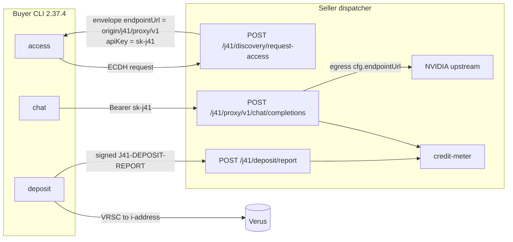
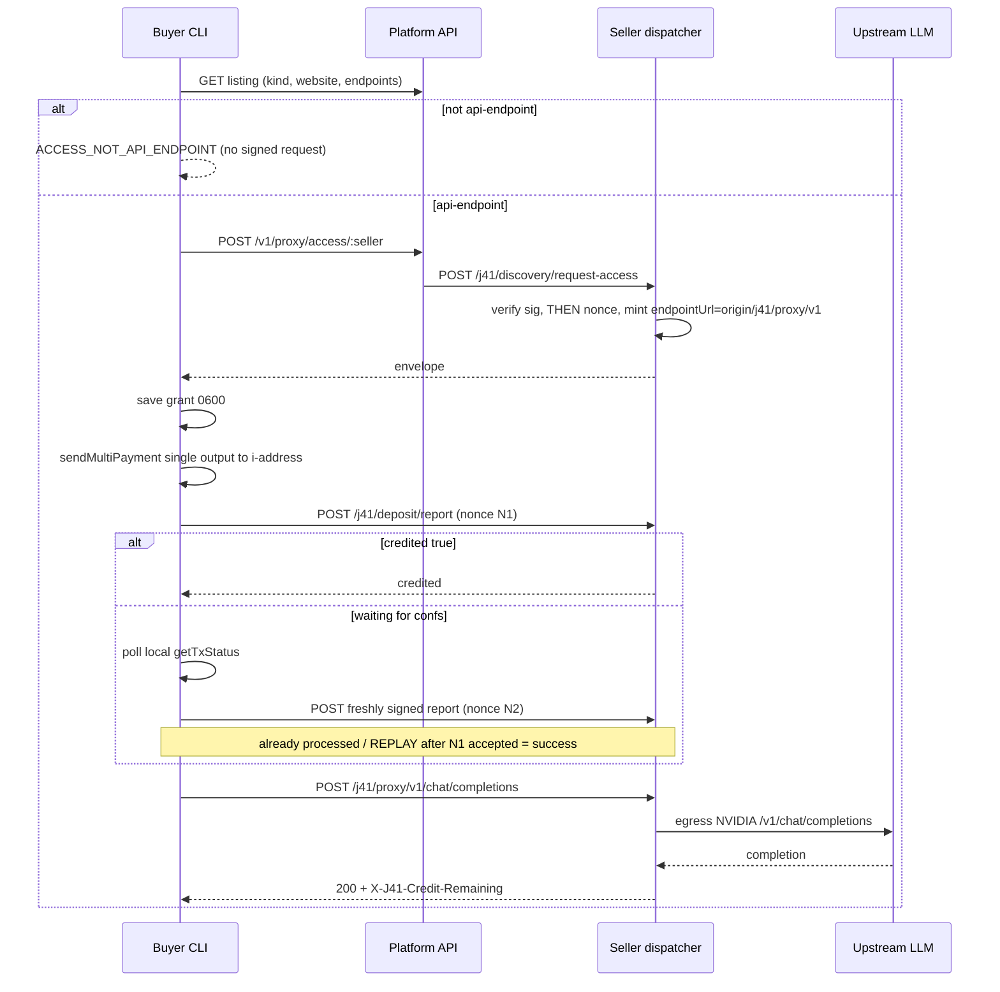
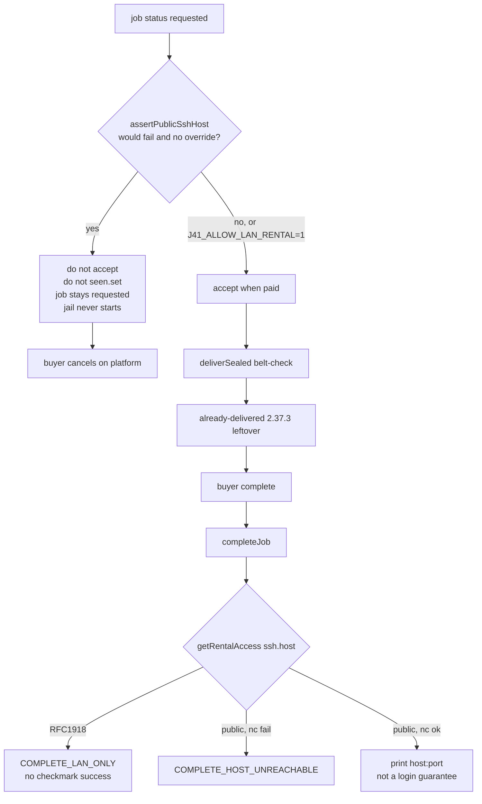

# Buyer lifecycle 2.37.4 — design

> **After compact / next session:** Do **not** implement until the user says **go**. Spec is complete. Backend brief to hand them: `docs/backend-responses/2026-09-06-dispatcher-2.37.4-full-path.md`. On **go**, implement PRs **1a–12** in this file, tests first, no npm `latest` claiming reviews until live `J41-REVIEW|`. Repo `/home/mainn/dispatchertest3/j41-sovagent-dispatcher`. Against git `1a340d8` / npm `@junction41/dispatcher@2.37.3`. Never print WIFs, tokens, minted apiKeys. Tester kit `~/j41-testkit`. Do not copy `~/.j41`. Models are not labour jobs (`access`+`deposit`+`chat`). Data is not a job (`browse`). GPU needs named TCP tunnel + doctor. Labour proof is an **orchard** listing, not dt3worker2.

**Date:** 2026-09-06
**Author:** dispatcher
**Status:** Draft (complete product — 2026-09-06 grow). Implementation waits on user **go**.
**Against:** published `@junction41/dispatcher@2.37.3` / alias `j41-dispatcher@2.37.3` (git `1a340d8`)
**SDK:** `@junction41/sovagent-sdk@2.16.1`
**Live API:** `https://api.junction41.io` commit `baf8af8df925` (VRSCTEST despite the hostname)
**Source:** buyer retest 2026-09-06 (`j41grokbuyer.agentplatform@` / agent-1) + seller remarks on orchard host xd322 (dispatcher 2.37.3)
**Backend takeaway:** `docs/backend-responses/2026-09-06-dispatcher-2.37.4-full-path.md`

2.37.3 shipped the 2.37.2 CLI holes. Live retest still did **not** produce usable work. This spec is the **complete** buyer+seller product for 2.37.4 — models, compute SSH, data fetch, labour chat, reviews, refunds, extend, dispute, doctor gates. Honesty-only cuts (refuse LAN and call it done, “curl the endpoints”, “reviews wait for backend with no contract”, “refunds are seller-only”) are **rejected**.

Must not regress: `PAY_PENDING` before `createJob`; `MODEL_NOT_A_LABOUR_JOB` (models stay **not** labour jobs — the product is access+deposit+chat); `DATA_NOT_HIREABLE` (data stays **not** a job — the product is `browse`); testnet pin `RBgxQwD7mMLCfciTN68RjBQHsH68vcnUKb` (fee-tank R `RAWwNeTLRg9urgnDPQtPyZ6NRycsmSY2J2` refused); review still fail-closed on `Junction41 Review` **until** backend `J41-REVIEW|` is live, then reviews must land; `start` refuse-before-accept on local without `--dev-unsafe`; never silent `runtime=local`; never apt Node.

Prior specs (do not re-open closed 2.37.2 / 2.37.3 work):

- `docs/superpowers/specs/2026-09-05-buyer-lifecycle-design.md`
- `docs/superpowers/specs/2026-09-05-world-bootstrap-polish-design.md`
- `CHANGELOG.md` 2.37.2 / 2.37.3

Do not implement until the user says **go**. Do not print WIFs, npm tokens, minted apiKeys, or provider keys. Config files mode 0600.

---

## Overview

2.37.3 can decrypt a model grant, pay a GPU job, and browse data — and still leave the buyer with a 404, a LAN SSH host, and a 402 they cannot top up. The mint writes NVIDIA's upstream into the ECDH envelope (`src/cli.js` `onAccessRequest` payload `endpointUrl: cfg.endpointUrl`). Buyer `chat` then aims SDK `callProxied` (default path `/v1/chat/completions`) at a base that already ends in `/v1`, so NVIDIA returns 404. The minted key is valid only on the seller `/j41/proxy/v1/*` (live 402, credit=0). There is no buyer `deposit` / `report-deposit` verb; `wallet send` is fleet-only.

This pass mints the **dispatcher proxy base**, aims `chat` at it without doubling `/v1`, adds a buyer deposit rail that POSTs `/j41/deposit/report` once then `--wait`s on local `getTxStatus` (no GET route), gates GPU **before accept** when `ssh_hostname` is RFC1918, unlinks `wallet-pending.json` when confirmations > 0, pins `json-canonicalize@2.0.0` in the job-agent image, and fixes the seller deposit reconciler crash `d.reversed is not iterable`.

Reviews stay fail-closed **only while** the platform still emits `Junction41 Review`. The release is not done until `J41-REVIEW|` is live and both identities show a review record, **or** the companion backend doc is rejected in writing. Named Cloudflare tunnels are **required product setup** (`tunnel-setup` + doctor), not a README shrug. Labour is in scope: orchard must run a labour listing; buyer `job-chat` is signed.

---

## Background & Motivation

### What 2.37.3 already does (keep)

| Claim | Code | Keep |
|---|---|---|
| `hire --pay` runs `planHirePayment` **before** `createJob` | `src/cli.js` hire action | yes. Immediate second `--pay` → `PAY_PENDING` with **no** `jobId`. |
| `listings` `hireable` / `next` from `assertHireAllowed` | `src/hire.js` `listingRowFromService` / `listingNext` | yes. Models `hireable:false next:access`. Data `hireable:false next:browse`. |
| `access` decrypts; `chat` wraps `callProxied` | `src/buyer-access.js` | decrypt yes; **chat URL is wrong**. |
| Testnet keys-endpoint pin | `src/platform-signer.js` | yes. Defaulted on `api.junction41.io`. Fee-tank R refused (`PLATFORM_SIGNER_NOT_FEE`). |
| `pay` / `complete` / `review` CLI | `src/cli.js` | yes. Review still fail-closed. |
| `wallet send` destinations are fleet agent-ids | `src/wallet.js` `planFleetSend` | yes. **Not** a buyer top-up path. |
| Seller `POST /j41/deposit/report` | `src/webhook-server.js` → `onDepositReport` → `reportDeposit` | yes. Buyer has no CLI that hits it. |
| `DATA_NOT_HIREABLE` / `MODEL_NOT_A_LABOUR_JOB` | `src/hire.js` | yes. |

### Live evidence (do not re-debug; treat as proven)

Buyer retest 2026-09-06 on **2.37.3** (j41grokbuyer.agentplatform@ / agent-1):

| Ask | 2.37.3 live |
|---|---|
| `hire --pay` checks pending **before** `createJob` | **Shipped.** Immediate second `--pay` → `PAY_PENDING` with **no** `jobId`. Keep. |
| `listings` hireable from `assertHireAllowed` | **Shipped.** Models `hireable:false next:access`. Data `hireable:false next:browse` (pippinapples in table). Keep. |
| `access` + `chat` | **Half.** `access` decrypts. `chat` **404s** (wrong URL + doubled `/v1`). Real proxy is 402 unpaid. |
| Testnet pin `RBgxQwD7mMLCfciTN68RjBQHsH68vcnUKb` | **Works.** Defaulted on `api.junction41.io`. Fee-tank R still refused. Keep. |
| Review `J41-REVIEW\|` | **Still fail-closed.** Backend flag still absent. Stay fail-closed. |
| Buyer VDXF write | **Still missing.** Do not invent a second writer. |
| GPU RFC1918 | **Still a seller tunnel.** Buyer `complete` succeeds anyway. |

Live jobs:

- sovagent dt3worker2 `eb7e34db-…` paid verified, status `requested`, buyer chat sent, seller never accepted, 0 seller messages. **Not orchard.** Out of 2.37.4 orchard scope unless a local labour listing is added.
- sovcompute testgpu01 `e70731db-…` paid, delivered `192.168.1.69:2222`, nc timeout, CLI `complete` → completed + witness.
- sovmodel duskseek / moonkimi: no labour job (correct). Envelope opened. `chat` 404. Real proxy 402 credit=0.
- sovdata pippinapples: bytes on live tunnel JSON 10 apples. Card **description** still names a dead tunnel.

`PAY_PENDING` on `hire --pay` compute immediately after labour pay: **no job created**. Unpaid compute create then `pay --wait` (~66s) worked. Keep that gate.

2.37.2 leftover unpaid duskseek/moonkimi labour jobs are **not** 2.37.4 regressions; operators should cancel/clean them.

### Model path — decrypt works, chat aimed at the wrong host

`j41-dispatcher access agent-1 duskseek.agentplatform@`:

- Defaulted pin `RBgxQwD7mMLCfciTN68RjBQHsH68vcnUKb`.
- Saved grant under `~/.j41/dispatcher/agents/agent-1/access/`.
- Envelope `endpointUrl` is **`https://integrate.api.nvidia.com/v1`** (upstream), not seller dispatcher `https://mitchell-conservation-ourselves-shirt.trycloudflare.com`.
- models correct. Minted `sk-…` (do not paste).

Then `chat --message`: `CHAT_FAILED  Proxy call failed: HTTP 404`.

SDK `J41Client.callProxied` (`node_modules/@junction41/sovagent-sdk/src/client/index.ts`):

```
base = endpointUrl.replace(/\/$/, '')
path = opts.path || '/v1/chat/completions'
url  = base + path
```

NVIDIA base already ends in `/v1` → `/v1/v1/chat/completions` → 404.
Correct NVIDIA path `/v1/chat/completions` with minted key → **401**. Envelope key is **not** a NVIDIA key.

Seller `/j41/health` → `{service:dispatcher,status:ok,agents:5,proxy:true}`.

`POST https://<seller-public>/j41/proxy/v1/chat/completions` with the **same** minted key:

HTTP 402 `{"error":"Insufficient credit","balance":0,"estimatedCost":0.01,"topupAddress":"<seller i-address>"}`

So: grant key **is valid on the seller proxy**. Envelope **points the buyer at NVIDIA**. Dispatcher `chat` never hits `/j41/proxy/v1/*`. Minting the upstream URL leaks the wrong host and would, if the key were a real NVIDIA key, bypass metering.

Seller local config has two URLs; mint uses the wrong one:

| Field | Value | Role |
|---|---|---|
| `apiEndpointUrl` / `llmBaseUrl` / platform `service.endpointUrl` | NVIDIA `integrate.api.nvidia.com/v1` | proxy **egress** (`src/proxy-handler.js` `config.endpointUrl`) |
| `publicUrl` + VDXF website / `networkEndpoints` | dispatcher Cloudflare | what the **buyer** must call |

2.37.3 mint payload (`src/cli.js` **5493**): `endpointUrl: cfg.endpointUrl` (= `apiSvc.endpointUrl` = NVIDIA). `publicUrl` is never written into `agentConfigs` or the envelope.

### Other buyer-caught issues this run

1. `chat` must use seller `/j41/proxy/v1/…`, not `grant.endpointUrl` when that URL is the upstream. Prefer listing public dispatcher URL + `/j41/proxy/v1/chat/completions`. Do not double `/v1`.
2. `deposit` / `report-deposit` CLI. 402 tells the buyer to pay `topupAddress`. No verb.
3. `wallet-pending.json` leftover. After `pay --wait` confirmed `2578c99f…`, `wallet show` still reported pending and the stamp file was still on disk minutes later. `resolveWalletPending` is supposed to unlink on `confirmations > 0`.
4. `access` on a labour-kind “API” listing → `NONCE_REPLAY` even on retry. Fail with a distinct code if the seller is not `api-endpoint`, **before** consuming the nonce.
5. No buyer chat CLI for labour jobs. REST `sendChatMessage` without signature was accepted (`signed: false`). **2.37.4 does not add labour `job-chat`.** Unsigned REST accept is backend. Out of orchard scope.

### Extra seller holes (in 2.37.4)

1. Envelope `endpointUrl` = upstream — highest model-path bug.
2. Deposit reconciler `d.reversed is not iterable`. `loadDeposits` fallback omits `reversed`; `_recheckReversals` iterates `d.reversed` bare (`src/deposit-watcher.js` ~310–316 and ~1263).
3. Job-agent image still pulls broken `json-canonicalize@2.0.1` via `package.docker.json` (SDK `2.14.1` declares `^2.0.0`). `2.0.1` sets `main: ./bundles/index.umd.js` and ships no `bundles/`. Labour containers crash `MODULE_NOT_FOUND` on attestation import. Host `package.json` already pins `2.0.0`. Orchard pinned `2.0.0` locally. **Ship the pin.** Models should not use this image.
4. Platform webhooks often never arrive; webhook mode's only fallback is a **5 min** inbox safety poll (`src/cli.js` ~5627). Poll mode is 60s. Honesty + cheap dispatcher-side poll in webhook mode. Do not pretend to fix J41 webhook delivery.
5. `activate-all` / `deactivate-all` print `result.status` from SDK `setAgentStatus` (often the previous / inverted platform echo).
6. Quick Cloudflare URLs rotate — `tunnel-setup` writes named HTTP+TCP config; doctor fails until `publicUrl` / `ssh_hostname` are public. Dispatcher does not create the Cloudflare account.
7. `job.completed` on gpu-rental is deliver, not jail teardown. Jail runs until `expiresAt` (`src/rental-worker.js` `shouldTeardownRental`).

---

## Goals & Non-Goals

### Goals

Every row is a **ship gate**. Unit-green is not enough.

1. **Models (not hireable as jobs).** `access` envelope `endpointUrl` is dispatcher `/j41/proxy/v1`, never NVIDIA. `chat` hits that URL, no doubled `/v1`. After `deposit --wait`, proxy returns a completion. Seller `api-keys.json` usage > 0. Stale grants refresh from VDXF when `/j41/health` fails.
2. **Compute (hireable `gpu-rental`).** Buyer Mac can `nc` the sealed SSH host:port. Jail shows `nvidia-smi`. `tunnel-setup` writes named HTTP+TCP cloudflared config and sets `publicUrl` / `ssh_hostname`. RFC1918 refused before accept unless `J41_ALLOW_LAN_RENTAL=1` (dev only). `complete` fail-loud if probe fails. Buyer `extend` pays and the lease grows.
3. **Data (not hireable).** `browse` GETs website/endpoints and prints bytes. Description cannot hold dead tunnels. `"10 apples"` allowed.
4. **Labour (hireable `agent`).** Orchard runs a labour listing. Paid job is accepted and a **seller** message exists within one poll interval. Buyer `job-chat` sends a **signed** REST message and prints replies. `access` on labour is `ACCESS_NOT_API_ENDPOINT` before nonce.
5. **Pay.** `hire --pay` while pending → `PAY_PENDING` and no new `jobId`. Stamp unlinks after `pay --wait` confirms.
6. **Deposit.** Buyer `deposit` / `report-deposit`. Reconciler never throws `d.reversed is not iterable`. Credits stick.
7. **Reviews.** CLI exists. Backend must emit `J41-REVIEW|`. After that, `review` succeeds and `review.record` is on **seller and buyer**. Empty both sides is a **fail**.
8. **Refunds / dispute.** Buyer `dispute` (signed `J41-DISPUTE|`). Seller `respond-dispute` already exists. Buyer sees refund txid or a loud seller-queue state.
9. **Doctor / start.** Fail-closed: model `publicUrl`, compute public `ssh_hostname`, webhook mode if any api-endpoint, job-agent image after canonicalize pin.
10. Pin `json-canonicalize@2.0.0` in the job-agent image and **rebuild** orchard `j41/job-agent` before retest.
11. Honest copy: activate/deactivate verb; webhook+60s poll; `job.completed` ≠ jail teardown.

### Non-goals (narrow)

These are the **only** things this repo will not implement. They are still **named contracts**.

- Cloudflare control plane (creating the named-tunnel account). Dispatcher **writes config + doctor**. Operator pastes two hostnames once.
- Emitting `J41-REVIEW|` inside the platform. Dispatcher will not rewrite `Junction41 Review`. Tagging 2.37.4 as latest **waits** on that flag because this release **claims reviews**.
- Platform webhook delivery reliability. Dispatcher polls; that is pickup.
- Turning `wallet send` into an external payout. Buyer deposit uses `sendMultiPayment`. Refunds use dispute + the refunds queue.
- Windows Cat-1 GPU. Hide compute off Linux.
- Apt Node. Silent `runtime=local`.
- Minting sovdata/sovmodel as first-run identities.
- Growing `cli.js` when a helper will do.

---

## 2.37.4 retest pass bar

| Path | Pass only if |
| --- | --- |
| Models | Envelope host is the **dispatcher** `/j41/proxy/v1`, not NVIDIA. `chat` one completion (not 402/401/404). Seller `api-keys.json` usage > 0. After seller restart, `chat` still hits a host whose `/j41/health` is `service=dispatcher` (grant refresh). |
| GPU | Sealed SSH host is reachable from the **buyer Mac** (`nc` 3s). Jail `nvidia-smi`. `complete` does not print `✅ Job … completed` if probe fails. `extend --amount` grows `expiresAt`. New RFC1918 config is **not accepted** (dev override off). |
| Data | `listings` `next: browse`. `j41-dispatcher browse <seller>` prints the apples JSON. Description has no dead tunnel; `"10 apples"` may stay. |
| Labour | Orchard labour listing. Paid job leaves `requested` only while seller is down. With `start` + LLM: seller message within one poll. `job-chat --message` is `signed: true` and a seller line appears. |
| Pay | `hire --pay` while pending → `PAY_PENDING` **and** no new `jobId`. Stamp gone after `pay --wait`. |
| Review | Backend `J41-REVIEW\|` **and** both identities have `review.record` (or seller inbox type `review` + buyer attestation). Fail-closed without the prefix is **not** a pass. |
| Refund | Buyer `dispute` moves the job to `disputed`. Seller `respond-dispute --action refund` queues/sends. Buyer can `inspect` a refund txid or `refunds list` on seller shows the row. |
| Doctor | `doctor` fails compute on RFC1918 ssh, fails models without `publicUrl`/webhook, warns if job-agent image lacks canonicalize pin. |

Tester kit stays in `~/j41-testkit`. Do not copy `~/.j41`. Labour is the download; GPU is the Linux NVIDIA chapter. Cancel leftover unpaid 2.37.2 model-labour jobs before the retest.

---

## Key Decisions

1. **Mint `endpointUrl` = `{origin(publicUrl)}/j41/proxy/v1`.** Never `apiEndpointUrl` / platform `service.endpointUrl` / NVIDIA. Join is origin-only + fixed path so we cannot emit `/v1/v1`. If `publicUrl` is missing, refuse mint (`ENVELOPE_NO_PUBLIC_URL`). If public hostname equals upstream hostname (case-insensitive, `hostsEqual`), refuse (`ENVELOPE_UPSTREAM_URL`). Helpers throw `Object.assign(err, { code })`; webhook-server maps `e.code`.
2. **Buyer `chat` uses the minted proxy URL.** SDK default path `/v1/chat/completions` would double `/v1` on a base that already ends in `/v1`. `chatCompletions` therefore passes `path: '/chat/completions'` when the grant pathname ends in `/v1`. Stale 2.37.3 NVIDIA grants: do **not** treat `isDispatcherProxyBase(mintBuyerProxyBase(hint))` as a gate (it is always true for any http(s) URL). Listing-derived rewrite: `minted = mintBuyerProxyBase(hint)`; refuse if `hostsEqual(minted, grant.endpointUrl)` when the grant is not already a dispatcher base; **require** `GET {origin(minted)}/j41/health` JSON `service === 'dispatcher'`. Save 0600 only after that. Else `ACCESS_GRANT_UPSTREAM`, file unchanged. Never persist a website/NVIDIA/data-JSON URL as `endpointUrl`.
3. **Buyer `deposit` + `report-deposit` are new verbs.** Broadcast is `agent.sendMultiPayment` **single** output to the seller **i-address** (not `wallet send` / `executeSend`). Report URL first-win: (1) saved grant if `isDispatcherProxyBase(grant.endpointUrl)` (path check on the **saved** URL, not a minted hint); (2) listing endpoints/website via `mintBuyerProxyBase` **plus required** `/j41/health` `service === 'dispatcher'` (same listing-URL gate as chat; not `isDispatcherProxyBase(minted)`); (3) else `DEPOSIT_NO_PUBLIC_URL`. `--wait` on both commands: POST once; if pending, poll **local** `getTxStatus` until `requiredConfirmations`, then POST a **freshly signed** report (new nonce). `Deposit already processed` / `REPLAY` after a first accepted report for that txid is success. No GET deposit route. `--amount` required. Spend kind `deposit`; `expectedRecipients` is the i-address only. `DEPOSIT_WAIT_TIMEOUT` is warning, exit 0, JSON `ok: true`. `DEPOSIT_REPLAY` / `DEPOSIT_NO_PUBLIC_URL` stay exit 1.
4. **Gate RFC1918 before accept / before `state.seen.set` on every entry point.** Same helper before `acceptJob` in poll, webhook `job.accepted`, and `accept-job` CLI; and at the top of `startRentalJobWired` (poll start, webhook `job.started`, queue). Default: do not accept, do not start the jail, do not deliver. Job stays `requested` so the buyer can cancel on the platform. `J41_ALLOW_LAN_RENTAL=1` is the override (not default). `deliverSealed` still refuse-closes as belt. Buyer `complete` stay-completes **only** jobs that already reached `delivered` (2.37.3 leftovers like `e70731db-…`); it cannot unstick a 2.37.4 LAN hire that never delivered. Fail-loud (`COMPLETE_LAN_ONLY` / `COMPLETE_HOST_UNREACHABLE`); never print `✅ Job … completed` on those warnings. No auto-refund this pass.
5. **`json-canonicalize` pin 2.0.0** in `package.docker.json` (direct dep + `resolutions`/`overrides`). Do **not** require a docker SDK bump to 2.16.1 in the same change; 2.14.1 + the pin is enough. SDK 2.16.1 in the image is a follow-up after container smoke.
6. **Labour `access` → `ACCESS_NOT_API_ENDPOINT` before nonce.** Buyer preflight requires `serviceType === 'api-endpoint'` (kind=model alone is not enough). Seller: same `serviceType` check (not `_isApiEndpoint` stamp) **before** v1 `verifyAccessRequest` (`isReplay` records during verify) and before v2 `checkNonceAfterVerify`.
7. **Data description never contains ephemeral tunnel URLs.** Refuse `--service-description` / `--profile-description` for kind=data when the text contains trycloudflare/ngrok/localhost or a **dotted-quad** RFC1918/loopback address. `"10 apples"` is allowed. Live bytes live in `--profile-website` / `--network-endpoints`. Do not auto-rewrite pippinapples; operator `update-profile`.
8. **`pay --wait` waits after broadcast too.** `txConfirmations` unlinks only when `Number(confirmations) > 0` after unwrap. `confirmed === true` is used **only** when the `confirmations` key is absent (weaker path). `{ confirmed: true, confirmations: 0 }` keeps the stamp. Missing `getTxStatus` keeps the stamp.
9. **Webhook mode runs one 60s `pollForJobs` in addition to the HTTP receiver.** Do not start a second 60s loop on poll mode. Banner: J41 webhooks are best-effort; poll is the source of truth. Log `recovered` only in webhook mode for a job that was not in `state.seen` at poll start. Keep the 300s inbox-count safety.
10. **`activate-all` / `deactivate-all` print the verb**, not `result.status`. `"activated"` / `"deactivated"`.
11. **Labour `job-chat` is in.** Buyer REST `POST /v1/jobs/:id/messages` with a signature over `J41-CHAT|Job:<jobHash>|Ts:<unix>|<sha256(content)>`. Unsigned posts are a backend hole; we still sign. `job-chat --wait` polls `getChatMessages` until a seller line or timeout.
12. **Reviews are in, backend is on the critical path.** Dispatcher already wraps `submitReview`. We will not rewrite `Junction41 Review`. Tag 2.37.4 **latest** only after live `GET /v1/reviews/message` starts with `J41-REVIEW|` (or any `J41-` that binds jobHash+rating) **and** a review lands on seller inbox / buyer attestation. Companion: `docs/backend-responses/2026-09-05-buyer-lifecycle-asks.md` ask 1 + buyer `review.record` inbox.
13. **Chat grant refresh.** If saved grant `/j41/health` fails, `resolveListingDispatcherBase` from live VDXF website/endpoints (required dispatcher health). Save 0600 only after success. Named HTTP tunnel is the durable fix; refresh is the trycloudflare hatch.
14. **`tunnel-setup` is a product verb.** Writes `~/.j41/dispatcher/tunnels/<agent-id>/config.yml` for a named Cloudflare **HTTP** ingress (`publicUrl` → webhook+proxy) and a named **TCP** ingress (`ssh_hostname` → `127.0.0.1:$ssh_tunnel_port`). Does not call Cloudflare’s API. Operator supplies `--http-host` and `--ssh-host` (the DNS names they routed). Doctor/start fail compute without a public ssh host; fail models without publicUrl.
15. **Buyer `extend`.** `extend <buyer> <job-id> --amount` → `requestExtension` then the same dual-pay + `payExtension` as hire. GPU seller `handleExtensionRequest` already auto-approves on the lease. Labour extend on `delivered` is a proven 400 — refuse `EXTEND_NOT_OPEN` unless status is `in_progress`/`paused` (labour) or an active gpu-rental lease. Cat-1: only payment extends a delivered lease; we pay.
16. **Buyer `dispute` / `cancel`.** `dispute <buyer> <job-id> --reason` signs `buildDisputeMessage` (`J41-DISPUTE|…`) via SDK `disputeJob`. `cancel <buyer> <job-id>` wraps `cancelJob` (requested only). Seller `respond-dispute` already exists; `refunds` queue already exists. After seller `--action refund`, drain or `refunds approve` is the money path. Buyer `inspect` prints dispute status + refund txid when present.
17. **Buyer `browse`.** Resolve listing `networkEndpoints[0]` / website (not description). GET. Print body. `--path` appends. Fail `BROWSE_NO_ENDPOINT` if missing. Never GET a trycloudflare host taken from description.
18. **Orchard labour listing is a ship step**, not a code skip. xd322 must `start` a kind=agent labour identity with LLM preflight passing. Tester hires **that** seller, not dt3worker2, for the labour pass bar.
19. **Doctor gates** (fail, not warn): compute `ssh_hostname` fails `assertPublicSshHost`; any api-endpoint agent missing `publicUrl`; webhook server not bound while api-endpoint listed; `package.docker.json` canonicalize unpinned in the running image label if we can read it.
20. **`complete` probes GPU SSH** (host+port only). Fail-loud `COMPLETE_HOST_UNREACHABLE` / `COMPLETE_LAN_ONLY`. Leftover delivered LAN jobs: complete the job (money) but **never** print `✅ Job … completed`. JSON `ok: true, warning`. New jobs should not be LAN.

---

## Proposed Design

### Architecture (model path)



### Sequence — access + deposit + chat



---

## 1. Envelope mint — public proxy base, never upstream

### Bug

`src/cli.js` boot builds `agentConfigs` with `endpointUrl: apiSvc.endpointUrl` (NVIDIA). `onAccessRequest` mints:

```javascript
const payload = {
  apiKey: keyRecord.key,
  endpointUrl: cfg.endpointUrl,  // NVIDIA
  ...
};
```

`cfg.endpointUrl` is the correct **egress** URL for `handleProxyRequest`. It is the wrong URL to hand a buyer.

`publicUrl` is already written by `api-setup --public-url` and the TUI API-endpoint screen (`agent-config.json` mode 0600). VDXF `networkEndpoints` / website is what operators curl. Neither is copied into `agentConfigs` today.

### Join rules (never emit `/v1/v1`)

Extract `src/buyer-proxy-url.js` (pure, tested). Do not grow `cli.js`.

```javascript
function codedError(code, message) {
  return Object.assign(new Error(message), { code });
}

function originOf(url) {
  let u;
  try { u = new URL(String(url)); }
  catch { throw codedError('ENVELOPE_BAD_PUBLIC_URL', 'publicUrl is not a URL'); }
  if (!/^https?:$/i.test(u.protocol)) {
    throw codedError('ENVELOPE_BAD_PUBLIC_URL', 'publicUrl must be http(s)');
  }
  return u.origin; // scheme + host + port, no path
}

function hostsEqual(a, b) {
  try {
    return new URL(a).hostname.toLowerCase() === new URL(b).hostname.toLowerCase();
  } catch { return false; }
}

function mintBuyerProxyBase(publicUrl) {
  // ALWAYS rebuild. Ignore any path the operator pasted
  // (https://foo.example/j41/proxy/v1, https://foo.example/, …).
  return `${originOf(publicUrl)}/j41/proxy/v1`;
}

function callProxiedPath(endpointUrl) {
  // SDK default path is /v1/chat/completions. A base that already ends
  // in /v1 would become /v1/v1/chat/completions.
  const path = new URL(endpointUrl).pathname.replace(/\/+$/, '');
  if (path.endsWith('/v1')) return '/chat/completions';
  return '/v1/chat/completions';
}

function depositReportUrl(publicOrProxyUrl) {
  return `${originOf(publicOrProxyUrl)}/j41/deposit/report`;
}

function isDispatcherProxyBase(url) {
  try {
    const p = new URL(url).pathname.replace(/\/+$/, '');
    return p === '/j41/proxy/v1' || p === '/j41/proxy';
  } catch { return false; }
}

/**
 * REQUIRED for listing-derived URLs. mintBuyerProxyBase always returns
 * `{origin}/j41/proxy/v1`, so isDispatcherProxyBase(mintBuyerProxyBase(x))
 * is tautological (NVIDIA, marketing pages, data JSON all pass).
 * Live /j41/health is `{ service: 'dispatcher', status: 'ok', ... }`.
 * fetchImpl is injectable for tests.
 */
async function assertDispatcherHealth(origin, fetchImpl, failCode = 'ENVELOPE_NO_PUBLIC_URL') {
  const doFetch = fetchImpl || globalThis.fetch;
  const res = await doFetch(`${String(origin).replace(/\/+$/, '')}/j41/health`);
  if (!res || !res.ok) {
    throw codedError(failCode, `GET ${origin}/j41/health failed`);
  }
  let body;
  try { body = await res.json(); } catch {
    throw codedError(failCode, 'j41/health is not JSON');
  }
  if (!body || body.service !== 'dispatcher') {
    throw codedError(failCode, 'j41/health is not a dispatcher');
  }
  return true;
}

/** Listing-derived proxy base. Never use isDispatcherProxyBase(minted) as the gate. */
async function resolveListingDispatcherBase(hint, { grant, fetchImpl, failCode } = {}) {
  const code = failCode || 'ACCESS_GRANT_UPSTREAM';
  const minted = mintBuyerProxyBase(hint);
  if (grant && !isDispatcherProxyBase(grant.endpointUrl) && hostsEqual(minted, grant.endpointUrl)) {
    throw codedError(code, 'listing hint host is the grant upstream, not a dispatcher');
  }
  await assertDispatcherHealth(originOf(minted), fetchImpl, code);
  return minted;
}
```

`hostsEqual` compares **hostname only** (case-insensitive), not origin/port. `ENVELOPE_UPSTREAM_URL` therefore fires when the operator set `publicUrl` to the NVIDIA host (or any host equal to `cfg.endpointUrl`), which is the intended case. Port-only mismatches on the same host still refuse.

`webhook-server.js` maps discovery `e.code` (today every throw is 500 `"Access request failed"`):

| `e.code` | HTTP |
|---|---|
| `ACCESS_NOT_API_ENDPOINT` | 400 |
| `ENVELOPE_NO_PUBLIC_URL` | 503 |
| `ENVELOPE_UPSTREAM_URL` | 503 |
| `ENVELOPE_BAD_PUBLIC_URL` | 503 |

Final buyer chat URL: `{origin}/j41/proxy/v1` + `/chat/completions` = `{origin}/j41/proxy/v1/chat/completions`.

Seller proxy strips `/j41/proxy` then joins onto NVIDIA (`new URL('/v1/chat/completions', 'https://integrate.api.nvidia.com/v1')` → `https://integrate.api.nvidia.com/v1/chat/completions`). That path is already correct. Do not change egress.

### Mint payload

`agentConfigs` gains `publicUrl` (never overwrites egress `endpointUrl`):

| Source (first win) | Field |
|---|---|
| `agent-config.json` `publicUrl` | local |
| `start --webhook-url` / `cfg.runtime.webhook_url` | process |
| VDXF `networkEndpoints[0]` / website | on-chain |

Mint:

```javascript
const minted = mintBuyerProxyBase(cfg.publicUrl);
if (hostsEqual(minted, cfg.endpointUrl)) {
  throw codedError('ENVELOPE_UPSTREAM_URL', 'publicUrl host is the upstream');
}
payload.endpointUrl = minted;
```

If `publicUrl` missing: do **not** mint. Return HTTP 503 `{ error, code: 'ENVELOPE_NO_PUBLIC_URL' }`. A 500 `"Access request failed"` today hides this.

Start banner for each api-endpoint agent:

```
API Proxy: model-1 (duskseek@) egress integrate.api.nvidia.com  buyer https://<public>/j41/proxy/v1
```

If public is missing: `buyer UNREACHABLE — set publicUrl / --webhook-url; refusing to mint`.

### Buyer `chat` + stale 2.37.3 grants

`chatCompletions` (`src/buyer-access.js`):

1. If `isDispatcherProxyBase(grant.endpointUrl)`: use it. This is a **path** check on the saved URL (`/j41/proxy/v1`). A 2.37.3 NVIDIA grant has path `/v1` and correctly falls through. Do **not** run `mintBuyerProxyBase` on the grant itself as a gate.
2. Else try listing VDXF `networkEndpoints[0]` / website (`publicUrlHint`) via `resolveListingDispatcherBase(hint, { grant, failCode: 'ACCESS_GRANT_UPSTREAM' })`:
   - `minted = mintBuyerProxyBase(hint)`.
   - Refuse if `hostsEqual(minted, grant.endpointUrl)` when the grant is **not** already a dispatcher base (blocks NVIDIA hint → NVIDIA `/j41/proxy/v1`). Buyer `chatCompletions` has **no** seller `cfg.endpointUrl`; the grant URL is the only upstream host we know.
   - **Require** `GET {origin(minted)}/j41/health` JSON `service === 'dispatcher'` (not optional). Pathname is not a dispatcher check.
   - On that success: rewrite **in memory**, `saveAccessGrant` (0600) with `endpointUrl: minted`, proceed.
   - On any failure: `{ ok: false, code: 'ACCESS_GRANT_UPSTREAM', message: 'Grant endpointUrl is the upstream, not the seller proxy. Re-run: j41-dispatcher access <buyer> <seller>' }`. **Do not** overwrite the grant file. `callProxied` is not invoked.
3. `client.callProxied({ endpointUrl: grant.endpointUrl, apiKey, path: callProxiedPath(grant.endpointUrl), body })`.
4. Map 402 from SDK fields, not `e.message`. `callProxied` sets `err.statusCode`, `err.responseBody`, `err.responseHeaders`. If `e.statusCode === 402`, return `CHAT_NEEDS_DEPOSIT` with `topupAddress` / `estimatedCost` / `balance` from `e.responseBody` plus the `deposit` argv. Include `X-J41-Credit-SuggestedTopup` (header or body) as a **hint only**, never as a default `--amount`. Any other throw stays `CHAT_FAILED`.

`access` stdout already prints `endpoint ${grant.endpointUrl}`. After this spec that line is the dispatcher proxy. JSON `--json` still includes the full (secret) apiKey under `--yes` only.

---

## 2. Labour `access` — `ACCESS_NOT_API_ENDPOINT` before nonce

### Bug

Nonce cache records after verify (`checkNonceAfterVerify` / v1 `isReplay` → `checkAndRecordNonce`). A labour identity stamped `_isApiEndpoint` because it has VDXF `networkEndpoints` or `agent-config.json` `apiEndpointUrl` is treated as a proxy seller (`loadAgentCapabilities` flips every service). The signed request is accepted, nonce consumed, then the product is wrong — or a later retry with the same envelope is `NONCE_REPLAY`.

### Buyer CLI (before any SDK call)

`requestAndOpenAccess` (or a thin `assertAccessAllowed` next to `assertHireAllowed` in `src/hire.js`):

- Fetch seller listing + services.
- Allow only when some service has `serviceType === 'api-endpoint'`. Kind=`model` alone is **not** enough (a model listing with no api-endpoint service must not sign).
- Else `{ ok: false, code: 'ACCESS_NOT_API_ENDPOINT' }` — **do not** `buildAccessRequest` / `requestApiAccess`.

Kind `data` stays `DATA_NOT_HIREABLE` on hire; access is also `ACCESS_NOT_API_ENDPOINT`.

### Seller dispatcher (before nonce)

In `onAccessRequest`, after resolving `sellerAgent`, **before** verify / nonce:

```javascript
const cap = state.capabilities.get(sellerAgent.id);
const api = (cap && cap.services || []).some((s) => s && s.serviceType === 'api-endpoint');
if (!api) {
  const err = new Error('ACCESS_NOT_API_ENDPOINT');
  err.code = 'ACCESS_NOT_API_ENDPOINT';
  throw err;
}
```

Do **not** treat `_isApiEndpoint` or a bare `endpointUrl` as sufficient (`if (!cfg) throw` is not enough: labour with VDXF endpoints **has** `agentConfigs`). Throw `codedError('ACCESS_NOT_API_ENDPOINT', …)` so webhook-server maps HTTP 400 (today every discovery throw is 500 `"Access request failed"`).

Place this gate **above** v1 `verifyAccessRequest` (`isReplay` → `checkAndRecordNonce` during verify, `src/cli.js` 5480–5481) **and** above v2 `checkNonceAfterVerify`.

---

## 3. Buyer `deposit` / `report-deposit`

402 is expected without this verb. Seller `/j41/deposit/report` and `reportDeposit` already exist. SDK already exports `buildDepositReportMessage`.

### Commands

```
j41-dispatcher deposit <buyer-id> <seller> --amount <n> [--yes] [--wait] [--force] [--json]
j41-dispatcher report-deposit <buyer-id> <seller> --txid <txid> --amount <n> [--yes] [--wait] [--json]
```

Extract `src/buyer-deposit.js` (plan + build report + POST + `--wait` state machine). CLI is the impure rind. Broadcast is `agent.sendMultiPayment([{ address: iAddress, amount }])` — not `wallet send`, not `executeSend`.

### Report URL (first-win)

`deposit <buyer-id> <seller>` takes a VerusID, not a URL. Never derive origin from a NVIDIA grant.

1. Saved grant if `isDispatcherProxyBase(grant.endpointUrl)` → `depositReportUrl(grant.endpointUrl)`. This is a **path** check on the saved URL. A 2.37.3 NVIDIA grant (`…/v1`) correctly falls through. Do not mint the grant URL and then path-check the result.
2. Else listing `networkEndpoints[0]` / website via `resolveListingDispatcherBase(hint, { grant, failCode: 'DEPOSIT_NO_PUBLIC_URL' })` then `depositReportUrl(minted)`. **Required** `GET {origin}/j41/health` `service === 'dispatcher'`. Refuse if `hostsEqual(minted, grant.endpointUrl)` when the grant is not already a dispatcher base. Do **not** use `isDispatcherProxyBase(mintBuyerProxyBase(hint))` as the gate.
3. Else `DEPOSIT_NO_PUBLIC_URL` (exit 1): point at `j41-dispatcher access <buyer> <seller>` and seller `publicUrl` / `--webhook-url`. Grant file unchanged.

Refuse NVIDIA / any origin whose `/j41/health` is not a dispatcher. The seller must be in **webhook mode** (the proxy and `/j41/deposit/report` only exist when `--webhook-url` started `startWebhookServer`). Poll-only sellers cannot credit CLI deposits; say so.

### `--wait` protocol (no GET route)

`verifyDepositReport` records the nonce after verify. Re-POSTing the same signed body is `REPLAY` (HTTP 409). A first POST that credited returns `Deposit already processed` on retry. Seller `pollPendingDeposits` may credit without the buyer re-reporting. Suggested-topup default is 10 VRSC = 1-conf tier (`requiredConfirmations`: `<2` → 0, `<=10` → 1), so `--wait` is load-bearing.

```
1. Broadcast sendMultiPayment (single i-address output). Stamp wallet-pending kind:'deposit'.
2. POST report once (new nonce + signature).
3. credited: true → success. Stop.
4. pending / waiting-for-confs (HTTP 200, credited: false, waiting message):
     poll local client.getTxStatus(txid) every 5s using txConfirmations
     until txConfirmations(st) >= requiredConfirmations(amount) or 180s.
5. Then POST a freshly signed report (new nonce, same txid/amount).
6. Success if credited: true
     OR message/code is 'Deposit already processed'
     OR REPLAY / code REPLAY after this invocation already had an accepted
        (HTTP 200, not BAD_SIGNATURE) report for that txid.
7. First POST REPLAY with no prior accepted report this invocation → DEPOSIT_REPLAY, exit 1.
8. 180s without success → DEPOSIT_WAIT_TIMEOUT: warning, **exit 0**,
   JSON { ok: true, txid, credited: false, pending: true }. Money already moved.
   Do not double-spend. Same shape as PAY_WAIT_TIMEOUT.
```

`report-deposit` accepts `[--wait]` (same protocol from step 2; no broadcast). Do **not** invent `GET /j41/deposit/…` this pass.

Fail paths `DEPOSIT_REPLAY` / `DEPOSIT_NO_PUBLIC_URL` / `DEPOSIT_NOT_SELLER` / `PAY_PENDING` / spend denials: `process.exitCode = 1` then `process.exit(1)`. **`DEPOSIT_WAIT_TIMEOUT` is not a fail path** — warning, exit 0, JSON `ok: true`.

### Rules

| Rule | Detail |
|---|---|
| `--amount` | Required, positive decimal string. Parsed with `parseVrscAmount` (BigInt, never `parseFloat * 1e8`). No silent default of `proxy.suggested_topup_vrsc` (10). Print 402's `estimatedCost` / `X-J41-Credit-SuggestedTopup` as a hint, never as the spend. |
| Destination | Seller **i-address** from `getAgentPaymentAddress` (prefer `.iAddress`) / listing `payaddress` if it is that i-address. 402 `topupAddress` is a hint to display, **never** the autonomous `toAddress` alone (anti-tautology). A typed raw address is refused (`DEPOSIT_NOT_SELLER`). Do **not** include the seller R-address in `expectedRecipients` — a send to R would pass the gate and then `verifyPayment(expectedAddress: iAddress)` would not credit. |
| Outputs | **Single** output via `agent.sendMultiPayment`. No platform fee. |
| Spend gate | `planHirePayment` on `wallet-pending.json` (same `PAY_PENDING` / `--force` / `--wait` pre-broadcast). Autonomous (`--json` / headless mainnet): `gateExternalSend` kind `'deposit'`. |
| Mainnet | Same TTY / `J41_HEADLESS_MAINNET_PAY=1` as hire `--pay`. |
| Stamp | After broadcast: `saveWalletPending({ txid, at, kind: 'deposit' })` mode 0600. |
| Report | `buildDepositReportMessage({ buyerVerusId, sellerVerusId, txid, amount, nonce, timestamp })` → `signMessage` → POST the resolved `/j41/deposit/report`. Amount in the message is the same decimal string that was sent. |
| `wallet send` | Unchanged. Fleet agent-id → fleet agent-id only. |

Add `'deposit'` to `EXTERNAL_KINDS` and `KNOWN_KINDS` in `src/spend-policy.js`. Limiter key `deposit:<sellerId>` so a deposit cannot burn a job-pay budget. `toAddress` and `expectedRecipients` are the i-address (and listing `payaddress` only if it equals that i-address).

Interactive without `--yes`: `Broadcast <n> VRSC to <seller> i-address as API credit? This spends the buyer's wallet. (y/N)`.

Success human line truncates txid to 16 chars; JSON includes the full txid. Fail paths (`DEPOSIT_REPLAY`, `DEPOSIT_NO_PUBLIC_URL`, `DEPOSIT_NOT_SELLER`, `PAY_PENDING`, spend denials): `process.exitCode = 1` then `process.exit(1)`. `DEPOSIT_WAIT_TIMEOUT` is **not** among them (exit 0, JSON `ok: true`).

### Seller reconciler — `d.reversed is not iterable`

```310:316:src/deposit-watcher.js
function loadDeposits(agentId) {
  const p = depositsPath(agentId);
  try {
    if (fs.existsSync(p)) return _normalizeDeposits(JSON.parse(fs.readFileSync(p, 'utf8')));
  } catch {}
  return { processed: [], pending: [], creditedTxids: [] }; // missing reversed
}
```

`_recheckReversals` does `for (const r of d.reversed)` with no fallback. Agents that have never had a `deposits.json` (live `model-*`) throw; the catch logs `reconcile pass failed (d.reversed is not iterable) — credits left standing`.

`_normalizeDeposits` at line 166 already coerces `reversed: []` for files that **exist**. The TypeError is the **missing-file** path: `loadDeposits` 310–315 returns `{ processed, pending, creditedTxids }` **without** calling `_normalizeDeposits`. Throw sites: `_recheckReversals` 1263 `for (const r of d.reversed)`, `reconcileMeterAgainstLedger` 866, `listDepositAnomaliesForAgent` 1530/1539.

**Fix:**

- `loadDeposits` on missing/unreadable file returns `_normalizeDeposits({})` (all four keys, including `reversed: []`).
- Belt: every iteration uses `Array.isArray(d.reversed) ? d.reversed : []`.
- **Export `loadDeposits`** from `deposit-watcher.js` (today it is not in `module.exports`). Tests may also drive `_recheckReversals` + `pollPendingDeposits`.

A reported deposit must be able to credit after this. 402 → deposit → chat is the model pass bar. This reconciler fix is **PR 1a**, independent of the labour image pin.

---

## 4. GPU — gate LAN before accept; complete is honest only for leftovers

### Today

`assertTunnelHostname` refuses loopback / `0.0.0.0` / HTTP URLs, **not** RFC1918 (`src/providers/home-gpu.js` 9–18). `isPrivateIp` (`src/proxy-handler.js`) covers RFC1918/ULA/link-local **IP literals**; hostname `.local` / `.internal` still need extra checks. Orchard `ssh_hostname = "192.168.1.69"` is accepted. HTTP quick tunnels do not carry SSH. Jail is real. `startRentalJob` always `deliverSealed`. Buyer `complete` wraps `completeJob` and **always** prints `✅ Job ${id} completed` (`src/cli.js` 3250) — it never prints “SSH ready”. `nc` from the buyer Mac times out.

If we only refuse at `deliverSealed` after accept:

- `pollForJobs` sets `state.seen` **before** `startJobOrRental` (`src/cli.js` 9401–9410). Seen TTL is 7 days.
- On throw, `startRentalJob` `releaseLease` and rethrows (`src/rental-worker.js` 122–128). Jail is gone.
- The job is not retried even if the operator later points `ssh_hostname` at a named TCP tunnel.
- Buyer `complete` requires `job.status === 'delivered'` (3242–3243). After `RENTAL_LAN_HOST` the job stays `accepted` + paid → `COMPLETE_NOT_DELIVERED`. Money sits with the seller.

That is the contradiction Key Decision 4 originally papered over. **Refuse-deliver after accept is not the 2.37.4 default.**

`job.completed` (webhook or poll) is **not** jail teardown. `shouldTeardownRental` yanks only on `cancelled` / `resolved` / `resolved_rejected`, else waits for `expiresAt`.

### Decision



**Seller — gate before accept / before start, every entry point:**

New helper `assertPublicSshHost(host)` in `src/ssh-host.js` (not `cli.js`). Reuse `isPrivateIp` for IP literals; also fail `localhost`, `.local`, `.internal`, unspecified, unless `process.env.J41_ALLOW_LAN_RENTAL === '1'`. Wrap as `assertRentalHostPublic(agentId)` that loads that agent's `ssh_hostname` and throws `RENTAL_LAN_HOST`.

Call it on **every** accept and every start (not poll-only). Today (`1a340d8`):

| Path | Site | Gate |
|---|---|---|
| Poll accept | `acceptJob` `src/cli.js` ~9354, then `state.seen.set` ~9401 **before** `startJobOrRental` | **before** `acceptJob` |
| Webhook `job.accepted` | `acceptJob` ~9741 — no LAN check today | **before** `acceptJob` |
| `accept-job` CLI | ~2777–2816 one-shot stacked accept | **before** `acceptJob`; exit non-zero `RENTAL_LAN_HOST` |
| `startRentalJobWired` | ~11865 acquire + `deliverSealed`; also webhook `job.started` ~9773, queue ~11904 / ~9626 | **at the top**, before `acquireRentalLease` |
| `deliverSealed` | belt | unchanged, before `postRentalSecret` |

Bounty `acceptJob` (~10036) is labour, not gpu-rental — skip unless `isGpuRentalJob`.

On a `gpu-rental` job when the helper would throw:

- Do **not** `acceptJob`, do **not** mark seen, do **not** acquire. Log `[Rental] RENTAL_LAN_HOST — not accepting job <id>; point ssh_hostname at a named TCP tunnel or set J41_ALLOW_LAN_RENTAL=1`. Job stays **`requested`**. Buyer can cancel on the website / existing platform cancel. Dispatcher does **not** auto-refund this pass.
- If already `accepted` when we first see it (upgrade mid-flight, or webhook/CLI accepted before this gate): still do **not** `seen.set`, and `startRentalJobWired` returns without acquire. Next poll can pick it up after the operator sets a public hostname or the override. `complete` cannot save these (`COMPLETE_NOT_DELIVERED`). Operator recovery: named tunnel + wait for poll, or platform cancel/refund.

`deliverSealed` still calls `assertPublicSshHost` **before** `postRentalSecret` (belt). On throw, existing `releaseLease` stands — but the default path never gets here.

`rental-setup` / TUI: **warn** if hostname is LAN (do not block writing `[compute.providers.*]`). Override is env, not config.toml, not `--yes`. Log once if override is on: `LAN rental override on — ssh.host is not reachable off this network`.

Jail is **not** started on the default LAN path. “Jail may still run for the operator” applied only under the override (or a leftover 2.37.3 jail).

**Buyer `complete` — leftovers only:**

- Allowed only when status is `delivered` (unchanged). That is leftover 2.37.3 jobs (`e70731db-…`) and public/override delivers. It is **not** “complete always works after a LAN hire”.
- After `completeJob`, if gpu-rental: `getRentalAccess`. Pin field path `access.ssh.host` / `access.ssh.port` matching `formatRentalDeliverable` (unwrap `.data` if present). TCP probe in `src/ssh-host.js` (`net.connect`, 3s) takes **only** host+port. Do not log password/privateKey. Test: probe helper is not passed the credential fields.
- RFC1918/loopback → JSON `{ ok: true, warning: 'COMPLETE_LAN_ONLY' }`, exit 0. Human stdout **must not** match `/✅ Job .* completed/`. Print `Job completed. Sealed SSH host is RFC1918 — not reachable off the seller LAN.`
- Public host, probe fail → `COMPLETE_HOST_UNREACHABLE`, same stdout rule.
- Do not pin `/SSH ready/i` — 2.37.3 never prints that; it would stay green while still claiming success with the checkmark.

**`job.completed` copy:**

Webhook/poll `job.completed` / `delivered` for `active.kind === 'gpu-rental'`: do **not** `sendToJobAgent`. Log `[Rental] credentials delivered; jail runs until expiresAt`. `emitEvent('job.delivered', { kind: 'gpu-rental', expiresAt })`.

Named TCP tunnel copy: dispatcher does **not** create Cloudflare named tunnels. HTTP quick tunnels do not carry SSH. Point a **named TCP** tunnel at `127.0.0.1:$ssh_tunnel_port`. `ssh_hostname` must be that public hostname, not `192.168.x.x`.

---

## 5. `wallet-pending` unlink

### Bug

`pay --wait` waits **before** pay until a previous stamp clears, then broadcasts, stamps, exits. It does not wait for the **new** tx to confirm.

`resolveWalletPending`:

```javascript
const confs = st && typeof st.confirmations === 'number' ? st.confirmations : 0;
if (confs > 0) unlink
```

Live leftover stamp is two bugs, both real on `1a340d8`:

1. `pay --wait` only waits **before** broadcast (`src/cli.js` 3184–3225), then `saveWalletPending` and exits.
2. `resolveWalletPending` requires `typeof st.confirmations === 'number'` (12983). SDK `getTxStatus` returns unwrapped `TxStatus` (`confirmations: number`, `confirmed: boolean`) from `res.data`, so a numeric count *should* unlink. `wallet show` swallows session errors (`catch { showClient = null }`, 13340), which keeps the file. Coerce is still the right belt (string counts, nested `.data`).

Treating `confirmed: true` as unlink when `confirmations` is `0` **weakens fail-closed**: the UTXO hazard is still real mid-index.

### Fix

Pure helper in `src/wallet.js` (not `cli.js`):

```javascript
function txConfirmations(st) {
  const nested = st && st.data && typeof st.data === 'object' && !('confirmations' in st);
  const s = nested ? st.data : st;
  if (!s || typeof s !== 'object') return 0;
  if (s.confirmations != null && s.confirmations !== '') {
    const n = Number(s.confirmations);
    return Number.isFinite(n) && n > 0 ? n : 0;
  }
  // Weaker path: indexer omitted confirmations but set confirmed.
  if (s.confirmed === true) return 1;
  return 0;
}
```

Unlink only when `txConfirmations(st) > 0`. `{ confirmed: true, confirmations: 0 }` **keeps** the stamp. `{ confirmed: true }` with **no** `confirmations` key unlinks (weaker, documented). Missing `getTxStatus` / throw keeps the stamp.

`wallet show`: if the client is missing `getTxStatus`, print `pending (could not query tx status — stamp kept)` rather than a silent leftover.

`pay --wait` / `hire --pay --wait` **after** a successful broadcast: poll `resolveWalletPending` every 5s until unlink or 180s. If timeout: payment already broadcast — print `PAY_WAIT_TIMEOUT` as a **warning**, exit 0 for the pay itself, JSON `{ ok: true, txid, pending: true }`. Do not double-spend.

Land this **before** the deposit CLI (PR 3 in the plan below). Deposit writes the same stamp `planHirePayment` reads.

---

## 6. Job-agent `json-canonicalize` pin

Host `package.json` already has `"json-canonicalize": "2.0.0"` plus `resolutions` / `overrides`. `package.docker.json` does not. It pins `@junction41/sovagent-sdk": "2.14.1"`, which declared `json-canonicalize: ^2.0.0`. `2.0.1` `main` points at a missing `bundles/index.umd.js`. `job-agent.js` requires the SDK at load → `privacy/attestation` → `MODULE_NOT_FOUND`.

SDK 2.14.2 changelog: pinned canonicalize `2.0.0` exactly. Host dispatcher is on SDK **2.16.1**.

**Ship in PR 1b** (labour image only; do not couple to the model-agent reconciler):

```json
{
  "dependencies": {
    "@junction41/sovagent-sdk": "2.14.1",
    "json-canonicalize": "2.0.0"
  },
  "resolutions": { "json-canonicalize": "2.0.0" },
  "overrides": { "json-canonicalize": "2.0.0" }
}
```

Do **not** require bumping docker SDK to 2.16.1 in this PR. 2.14.1 + the direct pin is enough to stop npm resolving `^2.0.0` → 2.0.1. Aligning the image SDK to host 2.16.1 is a follow-up after `j41-dispatcher build-image` container smoke, not a gate on model deposit credit.

`Dockerfile.job-agent` needs no extra COPY (`COPY package.docker.json ./package.json` then `npm install`). Rebuild before any labour retest. Models must not use this image.

---

## 7. Data listing description vs website/endpoints

Operators curl **website / `networkEndpoints`**, not the marketplace blurb. pippinapples description still names a dead tunnel; live bytes are on the current tunnel JSON.

**Rules:**

- `listings` table does not need to grow a description column. Keep `next: browse`. `DATA_NOT_HIREABLE` stays.
- `register` / `setup` / `finalize` / `update-profile`: if listing `kind === 'data'` (or parent `sovdata@`), refuse `--service-description` / `--profile-description` when `descriptionHasEphemeralUrl(text)`:

```javascript
function descriptionHasEphemeralUrl(text) {
  const s = String(text || '');
  return /trycloudflare\.com/i.test(s)
    || /\bngrok\b/i.test(s)
    || /\blocalhost\b/i.test(s)
    || /\b127\.0\.0\.1\b/.test(s)
    || /\b10\.(?:\d{1,3}\.){2}\d{1,3}\b/.test(s)
    || /\b192\.168\.(?:\d{1,3}\.)\d{1,3}\b/.test(s)
    || /\b172\.(1[6-9]|2\d|3[0-1])\.(?:\d{1,3}\.)\d{1,3}\b/.test(s);
}
```

  RFC1918 is **dotted quads**, not `10.`. `"pippinapples — 10 apples JSON"` is **allowed**. `"trycloudflare.com"` / `"10.0.0.1"` refuse → `DESCRIPTION_EPHEMERAL_URL`. Put the live URL in `--profile-website` / `--network-endpoints` only.
- TUI Configure Services: same refuse.
- Do **not** auto-rewrite the live pippinapples row from this repo. Operator `update-profile` / service update. Pass bar: description does not name a dead tunnel **or is omitted**.
- First-run must not mint sovdata.

---

## 8. Webhook honesty + cheap poll

Webhook mode (`--webhook-url`) starts the HTTP server and a **300s** inbox-count safety poll only. Job/status events that never arrive wait five minutes. Poll mode is 60s (or `poll.interval_ms`).

**2.37.4:** webhook mode runs **one** `pollForJobs` interval (default 60s, same `poll.interval_ms` as poll mode) **in addition to** the HTTP receiver. Keep the 300s inbox-count safety as-is. Do **not** start a second 60s loop when already in poll mode (the 5 min safety already calls `pollForJobs`; a duplicate 60s timer on poll mode is out of scope).

Start banner (webhook mode only):

```
Mode: WEBHOOK + poll (60s). J41 webhooks are best-effort; poll is the source of truth.
Named HTTP/TCP tunnels are operator infra — this process does not create them.
```

Log `[Poll] recovered job <id> (no webhook)` **only** when webhook mode is on **and** the job was not in `state.seen` at poll start. That is not proof of a platform miss (the webhook may still be in flight the same minute). Do not retry POSTs to J41. Do not claim webhook delivery is fixed.

---

## 9. `activate-all` / `deactivate-all` copy

Today: `console.log(\`✓ ${agentId} … — ${result.status}\`)` where `result.status` is SDK `setAgentStatus`'s platform echo (often the previous status). TUI `[15]/[16]` uses the same `result.status`.

Print the **verb**:

```
✓ agent-1 (name@) — activated
✓ agent-1 (name@) — deactivated
```

If we re-fetch platform status and it disagrees, warn `platform still reports <status> — inspect later` — do not invert the verb. Single-agent `activate` / `deactivate` already print `Agent activated` / `Agent deactivated` then `Platform status: ${result.status}`; change the second line to the verb as well so the three surfaces match.

---

## 10. Review / buyer VDXF (unchanged policy)

CLI `review` stays fail-closed on bytes that do not start with `J41-` (`REVIEW_NOT_CANONICAL`). Do not claim reviews in CHANGELOG / README / `--help` for 2.37.4.

Do not `buildIdentityUpdateTx` buyer `review.record` / `job.record`. When the backend emits a buyer-directed inbox item, reuse `processInboxForAgent`. Not this pass.

Empty `getAttestations(buyer)` and `getAttestations(seller)` after a release that claimed reviews is a **fail**. This release must not claim them.

---

## API / Interface Changes

### New CLI

```
j41-dispatcher deposit <buyer-id> <seller> --amount <n> [--yes] [--wait] [--force] [--json]
j41-dispatcher report-deposit <buyer-id> <seller> --txid <txid> --amount <n> [--yes] [--wait] [--json]
```

### Changed CLI behaviour

| Command | Change |
|---|---|
| `access` | Prints dispatcher proxy URL. Refuses unless `serviceType === 'api-endpoint'` (`ACCESS_NOT_API_ENDPOINT`) before signing. |
| `chat` | Hits `/j41/proxy/v1/chat/completions`. 402 via `statusCode`/`responseBody` → `CHAT_NEEDS_DEPOSIT`. Stale NVIDIA grant → rewrite only after **required** `/j41/health` `service === 'dispatcher'` (never `isDispatcherProxyBase(mintBuyerProxyBase(hint))`); else `ACCESS_GRANT_UPSTREAM` (file unchanged). |
| `complete` | Stay-completes **delivered** leftovers only. Fail-loud LAN / unreachable; stdout must not match `/✅ Job .* completed/` on those warnings. |
| `pay` / `hire --pay` | `--wait` also waits after broadcast; stamp unlinks on `Number(confirmations) > 0`. |
| `wallet show` | Resolve stamp with `txConfirmations`; missing `getTxStatus` is loud. |
| `activate-all` / `deactivate-all` / TUI 15–16 | Print verb, not `result.status`. |
| `rental-setup` / GPU accept | Warn LAN at setup; **do not accept** LAN gpu-rental unless `J41_ALLOW_LAN_RENTAL=1` (poll, webhook `job.accepted`, `accept-job` CLI, `startRentalJobWired`). |
| `register` / `update-profile` (data) | Refuse ephemeral URLs in description (dotted-quad RFC1918; `"10 apples"` allowed). |

### New / extended helpers

| Module | Export |
|---|---|
| `src/buyer-proxy-url.js` | `codedError`, `originOf`, `hostsEqual`, `mintBuyerProxyBase`, `callProxiedPath`, `depositReportUrl`, `isDispatcherProxyBase`, `assertDispatcherHealth`, `resolveListingDispatcherBase` |
| `src/buyer-deposit.js` | `planBuyerDeposit`, `resolveDepositReportUrl`, `buildSignedDepositReport`, `postDepositReport`, `waitForDepositCredit` |
| `src/hire.js` | `assertAccessAllowed` — requires `serviceType === 'api-endpoint'` |
| `src/ssh-host.js` | `assertPublicSshHost`, `assertRentalHostPublic(agentId)`, `probeSshHost({ host, port })` (no secrets) |
| `src/wallet.js` | `txConfirmations` |
| `src/buyer-access.js` | `chatCompletions` path + 402 via `statusCode`/`responseBody`; grant rewrite only after dispatcher-base check |
| `src/spend-policy.js` | kind `deposit` |
| `src/deposit-watcher.js` | export `loadDeposits`; always `_normalizeDeposits({})` on missing file |

Keep `assertPublicSshHost`, TCP probe, and `txConfirmations` **out of** `cli.js`. `cli.js` stays the impure rind (mint wiring, `complete` calling the helpers, activate copy, webhook poll).

### Envelope payload (seller mint)

Before: `endpointUrl` = NVIDIA `/v1`. After: `endpointUrl` = `{origin(publicUrl)}/j41/proxy/v1`. `apiKey` still the J41-metered `sk-…`. `models` unchanged.

### HTTP

Discovery maps `e.code`: `ACCESS_NOT_API_ENDPOINT` → 400; `ENVELOPE_NO_PUBLIC_URL` / `ENVELOPE_UPSTREAM_URL` / `ENVELOPE_BAD_PUBLIC_URL` → 503. Deposit report HTTP unchanged (`REPLAY` 409, etc.). No new GET deposit route.

### Env

| Name | Default | Meaning |
|---|---|---|
| `J41_ALLOW_LAN_RENTAL` | unset / not `1` | Permit accept + `deliverSealed` of RFC1918/loopback SSH hosts. |
| `J41_HEADLESS_MAINNET_PAY` | unchanged | Also covers `deposit`. |
| `J41_PLATFORM_SIGNER` | unchanged | Testnet default pin kept. |

No new config.toml keys required. `publicUrl` already exists on `agent-config.json`.

---

## Data Model Changes

### `~/.j41/dispatcher/agents/<id>/access/<seller>.json` (0600)

Unchanged shape: `{ seller, apiKey, endpointUrl, expiresAt, models, savedAt }`. `endpointUrl` **value** changes to the proxy base. Optional additive `publicUrl` / `depositReportUrl` if cheap; not required if `depositReportUrl(endpointUrl)` can derive origin.

No migration script. Stale NVIDIA files are rewritten on successful `access`, or on `chat` rewrite **only after** required `GET {origin}/j41/health` `service === 'dispatcher'` (and not `hostsEqual` to a non-dispatcher grant). Otherwise `ACCESS_GRANT_UPSTREAM` and the file is unchanged.

### `agent-config.json` (0600)

No schema change. Mint **reads** `publicUrl`. Egress remains `apiEndpointUrl`.

### `deposits.json` (0600)

No schema change. `loadDeposits` always materializes `reversed: []`.

### `wallet-pending.json` (0600)

`kind` may be `'deposit'` in addition to `'hire-pay'` / `'sweep'` / `'send'`. Same `{ txid, at, kind }` gate.

### Job-agent image

`package.docker.json` canonicalize pin only (SDK version may stay 2.14.1). Rebuild required (`j41-dispatcher build-image`). No live container migration.

---

## Alternatives Considered

### A. Mint origin only; let `callProxied` default `/v1/chat/completions`

Would produce `{origin}/v1/chat/completions`, **missing** `/j41/proxy`. Rejected — live proxy path is `/j41/proxy/v1/chat/completions`.

### B. Mint `{origin}/j41/proxy` (no `/v1`) and keep SDK default path

Produces the correct final URL. Rejected in favour of minting `/j41/proxy/v1` because (1) the prompt/live 402 path includes `/v1`, (2) OpenAI-shaped bases conventionally end in `/v1`, (3) `callProxiedPath` is a one-liner. Either join is valid if tests pin the **final** URL; we pick mint-with-`/v1` + path `/chat/completions`.

### C. Buyer `chat` always ignores the grant URL and looks up VDXF every call

More resilient to 2.37.3 grants; extra network round-trip; fails when VDXF is empty even if the grant is already correct. Rejected as the primary path. Used only as a stale-grant rewrite hint.

### D. Warn-only on RFC1918 deliver

Would keep orchard auto-delivering `192.168.1.69` as if public. Tester bar allows refuse **or** complete-not-success; warn-only fails the seller half. Rejected.

### E. Refuse buyer `complete` on RFC1918 (for leftover delivered jobs)

Would strand already-`delivered` 2.37.3 jobs (`e70731db-…`) that the buyer still needs to close. Money/lease semantics belong to `completeJob`. Rejected for leftovers. Fail-loud instead. **Not** a recovery path for 2.37.4 LAN hires that never delivered.

### E2. Refuse-deliver after accept (original 2.37.4 draft)

`state.seen` (7 day TTL) + `releaseLease` + `COMPLETE_NOT_DELIVERED` strands paid `accepted` jobs. Rejected as the default. Gate **before accept / before seen**.

### E3. Auto-cancel/refund on `RENTAL_LAN_HOST`

Would unstick money without operator action. Out of this pass unless an existing cancel path is already wired and cheap — it is not (no buyer `cancel` CLI; refunds queue is seller-side). Job stays `requested`; buyer cancels on the platform.

### F. Teach `wallet send` to take a raw i-address for deposits

Breaks the fleet-only invariant (`planFleetSend` exact agent-id). External payouts are refunds + financial-allowlist. Rejected. New `deposit` verb using `sendMultiPayment`.

### G. Silent rewrite of NVIDIA grant → trycloudflare without listing lookup

We do not know the seller public host from a NVIDIA URL. Would guess. Rejected. Loud `ACCESS_GRANT_UPSTREAM`. VDXF rewrite only after `resolveListingDispatcherBase`: `hostsEqual` refuse vs non-dispatcher grant **and required** `GET /j41/health` `service === 'dispatcher'`. Do not use `isDispatcherProxyBase(mintBuyerProxyBase(hint))` — it is always true.

---

## Security & Privacy Considerations

| Threat | Severity | Mitigation |
|---|---|---|
| Envelope points at upstream with a real vendor key | **High** (not this incident — key is J41 `sk-`; would bypass metering if it were NVIDIA) | Never mint `apiEndpointUrl`. Refuse when public host === upstream host. |
| Buyer `chat` sends J41 key to NVIDIA | Medium | Stale-grant refuse / rewrite. `isDispatcherProxyBase` gate. |
| Deposit report credit-theft | High (existing) | Keep signed `J41-DEPOSIT-REPORT`, sender verification, nonce-after-verify. No auth-only credit. |
| `deposit` as a new external spend | High | `gateExternalSend` kind `deposit`, expectedRecipients from chain, pending stamp, mainnet TTY, `--amount` required, `parseVrscAmount`. |
| LAN SSH delivered as public | High (credentials on a private IP; buyer thinks they have a box) | Do not accept / do not `seen.set` unless `J41_ALLOW_LAN_RENTAL=1`. `deliverSealed` belt. Override is loud. |
| Paid LAN job stuck `accepted` | High (refuse-after-accept) | Default is refuse-**before**-accept. No auto-refund this pass. |
| `--wait` REPLAY looks like failure | Medium | After a first accepted report for that txid, `REPLAY` / already-processed is success. |
| Labour access burning nonce cache | Low | ServiceType gate before nonce. Buyer preflight so we never send. |
| Description phishing via rotating tunnels | Low | Refuse ephemeral URLs in data description. |
| Minted apiKey in `--json` | Existing | Still requires `--yes`. Human path redacts. Do not paste keys in docs/tests. |
| `json-canonicalize@2.0.1` supply | High for labour attestation | Pin 2.0.0 in the image. |

`RENTAL_SECRETS_KEY` remains a Junction41 API operator env, not a dispatcher key. Sealed SSH still goes through `postRentalSecret`, never `deliverJob` notice.

---

## Observability

| Signal | Where |
|---|---|
| Minted buyer URL vs egress host | Start banner per api-endpoint agent; `[Discovery] Minted key … endpoint <proxy>` |
| `ENVELOPE_NO_PUBLIC_URL` / `ENVELOPE_UPSTREAM_URL` | Discovery HTTP code + log |
| `ACCESS_NOT_API_ENDPOINT` | Buyer CLI code; seller 400 |
| `CHAT_NEEDS_DEPOSIT` | Buyer CLI; include `topupAddress` |
| Deposit credited / pending confirmations | Existing `[Deposit]` / `[Deposits]` lines; reconciler must not crash |
| `RENTAL_LAN_HOST` | Seller log; job stays `requested`; jail not started |
| `COMPLETE_LAN_ONLY` / `COMPLETE_HOST_UNREACHABLE` | Buyer stdout (no checkmark) + JSON `warning` |
| Stamp unlink | `wallet show` silent when gone; warning when query failed |
| Webhook miss recovered by poll | `[Poll] recovered job` only in webhook mode, job not in `seen` at start |
| `job.delivered` (rental) vs labour `job.completed` | `state.emitEvent` + control-api ring |

No new metrics port. Existing `:9842` `/metrics` / `:9843` events are enough if the new `emitEvent` types fire.

Alerting: seller `d.reversed is not iterable` was the alert — it must disappear. Credit-low notify already exists; deposit CLI is what makes it actionable for a CLI buyer.

---

## Rollout Plan

1. **Tests first** (see below). Prove on the sandbox. No live chain in unit tests. No WIFs in fixtures. No minted keys in logs.
2. Land PRs in order (see PR Plan). Do not publish until the orchard retest pass bar is green on a local labour listing (optional) + models + GPU + data + pay.
3. Version bump to **2.37.4 only at ship**, scoped `@junction41/dispatcher` and alias `j41-dispatcher` lockstep. Same git tag.
4. `j41-dispatcher build-image` is required on every seller that runs labour (canonicalize pin, PR 1b). Models do not use that image; they still need a dispatcher **restart** to pick up mint + reconciler (PR 1a) + LAN accept gate.
5. Feature flags: only `J41_ALLOW_LAN_RENTAL` (off). No flag for the mint URL — the NVIDIA envelope is a defect, not a mode.
6. Rollback: publish 2.37.3 alias+scoped. Stale 2.37.4 grants pointing at `/j41/proxy/v1` would 404 on a rolled-back seller that no longer… no, 2.37.3 seller already has that route; 2.37.3 **mint** is the bug. Rolling back sellers re-breaks new `access` grants. Prefer forward fix.
7. Operators: re-`access` after upgrade (old grants are NVIDIA). Set `publicUrl` / named tunnels. Cancel leftover 2.37.2 unpaid duskseek/moonkimi labour jobs. Do not copy `~/.j41` between machines.

---

## Tests (pin before wiring)

No live chain. No WIFs. No apiKeys in fixtures (use `sk-test-…`).

**Mint / chat URL**

- `mintBuyerProxyBase('https://foo.example/j41/proxy/v1')` → `https://foo.example/j41/proxy/v1`
- `mintBuyerProxyBase('https://foo.example/')` → `https://foo.example/j41/proxy/v1`
- `mintBuyerProxyBase('https://integrate.api.nvidia.com/v1')` + upstream same host → `ENVELOPE_UPSTREAM_URL`
- `callProxiedPath('https://foo.example/j41/proxy/v1')` → `/chat/completions`
- `chatCompletions` passes that path; final URL never contains `/v1/v1`
- NVIDIA grant without hint → `ACCESS_GRANT_UPSTREAM`, `callProxied` not invoked, grant file unchanged
- NVIDIA hint `https://integrate.api.nvidia.com/v1` → `mintBuyerProxyBase` yields `https://integrate.api.nvidia.com/j41/proxy/v1` → **refuse** (`hostsEqual` to grant and/or health is not `service:dispatcher`); grant file unchanged; `callProxied` not invoked
- Marketing-page hint without dispatcher health body → refuse, file unchanged
- Listing hint whose origin `/j41/health` is `{ service: 'dispatcher' }` → rewritten, saved 0600, call proceeds
- `isDispatcherProxyBase(mintBuyerProxyBase('https://example.com')) === true` (tautology — must **not** be used as a gate)
- `hostsEqual('https://A/v1', 'https://A/j41/proxy/v1')` is true
- `codedError('ENVELOPE_NO_PUBLIC_URL', …).code === 'ENVELOPE_NO_PUBLIC_URL'`

**Access gate**

- Kind=model with **no** `serviceType === 'api-endpoint'` → `ACCESS_NOT_API_ENDPOINT`; nonce cache size unchanged; no signed request
- `serviceType === 'api-endpoint'` still mints
- `_isApiEndpoint` stamp alone is **not** enough on the seller
- Seller v1 path: serviceType gate is **above** `verifyAccessRequest` (`isReplay` records during verify)

**Deposit**

- `loadDeposits` missing file: `reversed` iterable; `_recheckReversals` does not throw (export `loadDeposits`)
- `planBuyerDeposit` pending → `PAY_PENDING`; `--force` passes
- Autonomous `toAddress` is seller R-address → deny (i-address only)
- NVIDIA grant origin is not used as report URL (`DEPOSIT_NO_PUBLIC_URL` or listing rewrite after required health)
- Listing hint without dispatcher `/j41/health` → `DEPOSIT_NO_PUBLIC_URL`, no POST
- `--wait`: first POST pending → poll `getTxStatus` → second POST new nonce; `Deposit already processed` after first accepted report is success; `REPLAY` after first accepted report is success; first-POST `REPLAY` is `DEPOSIT_REPLAY` exit 1
- `DEPOSIT_WAIT_TIMEOUT` → exit 0, JSON `ok: true`; `report-deposit` synopsis includes `--wait`
- `report-deposit` builds `J41-DEPOSIT-REPORT|…` field order matching SDK
- Broadcast is `sendMultiPayment` single output (source pin)

**GPU**

- Requested gpu-rental with RFC1918 `ssh_hostname`: `acceptJob` not called; `state.seen` not set; jail not acquired
- Webhook `job.accepted` does not call `acceptJob` on RFC1918
- `accept-job` CLI exits non-zero `RENTAL_LAN_HOST` on RFC1918
- `startRentalJobWired` does not `acquireRentalLease` on RFC1918
- `deliverSealed` RFC1918 throws `RENTAL_LAN_HOST`; `postRentalSecret` not called; override env allows
- `complete` JSON on RFC1918 delivered leftover: `ok: true`, `warning: 'COMPLETE_LAN_ONLY'`; stdout does **not** match `/✅ Job .* completed/`
- `getRentalAccess` reads `ssh.host` / `ssh.port`; probe helper is not passed `password` / `privateKey`

**Wallet pending**

- `confirmations: '2'` unlinks
- `{ data: { confirmations: 1 } }` unlinks
- `{ confirmed: true }` (no confirmations key) unlinks — weaker path
- `{ confirmed: true, confirmations: 0 }` **keeps** the stamp
- missing `getTxStatus` keeps stamp
- hire source still has `planHirePayment` **before** `createJob`

**Image**

- `package.docker.json` `dependencies['json-canonicalize'] === '2.0.0'`
- resolutions/overrides present
- SDK version in docker package is **not** required to be 2.16.1 in PR 1b

**Copy**

- `activate-all` source does not print `` `${result.status}` `` as the success verb
- data description: `"10 apples JSON"` allowed; `"https://x.trycloudflare.com"` refused; `"10.0.0.1"` refused
- start banner in webhook mode matches `/poll is the source of truth/i` (source pin)
- webhook mode registers one `pollForJobs` interval; poll mode does not gain a second 60s timer from this spec

**Keep green**

- `test/hire-pay.test.js` before-createJob
- `test/buyer-access.test.js` pin / fee-tank refuse
- `test/hire.test.js` `DATA_NOT_HIREABLE` / `MODEL_NOT_A_LABOUR_JOB`
- Review `REVIEW_NOT_CANONICAL` on `Junction41 Review`

---

## 11. Grant refresh (trycloudflare survival)

If `chat` or `deposit` would use a saved grant whose origin fails `GET /j41/health` (`service === 'dispatcher'`), call `resolveListingDispatcherBase(hint)` from the seller’s **current** VDXF website/endpoints (same required health as Key Decision 2). Save 0600 only after success. Else `ACCESS_GRANT_STALE` / `DEPOSIT_NO_PUBLIC_URL`, file unchanged.

Tests: grant origin 404s health → listing hint with live dispatcher health → new endpoint saved, `callProxied` uses new origin. Listing hint without dispatcher health → refuse, file unchanged.

Named HTTP tunnels still required for production; this hatch is for orchard quick tunnels until `tunnel-setup` is used.

## 12. `tunnel-setup` (HTTP + TCP)

New module `src/tunnel-setup.js`. CLI:

```
j41-dispatcher tunnel-setup <agent-id> --http-host <dns> --ssh-host <dns>
  [--ssh-port 2222] [--write-config]
```

Writes `~/.j41/dispatcher/tunnels/<agent-id>/config.yml` (mode 0600):

```yaml
ingress:
  - hostname: <http-host>
    service: http://127.0.0.1:<webhookPort>
  - hostname: <ssh-host>
    service: tcp://127.0.0.1:<ssh-port>
  - service: http_status:404
```

Prints the operator commands (do not shell out to `cloudflared` unless it is on PATH **and** `--run` is passed — default is print-only):

```
cloudflared tunnel route dns <tunnel> <http-host>
cloudflared tunnel route dns <tunnel> <ssh-host>
cloudflared tunnel --config <path> run
```

Then sets `agent-config.json` `publicUrl = https://<http-host>` and dispatcher `ssh_hostname = <ssh-host>` / `ssh_tunnel_port`. `update-profile` website/endpoints to `https://<http-host>`.

`rental-setup` **fails** if `ssh_hostname` fails `assertPublicSshHost` unless `J41_ALLOW_LAN_RENTAL=1`. `api-setup` **fails** without `publicUrl` / `--webhook-url`.

Doctor: compute listing + RFC1918 ssh → fail. api-endpoint + empty publicUrl → fail. Webhook not listening while api-endpoint listed → fail.

Tests: written YAML contains both ingresses; RFC1918 `--ssh-host 192.168.1.69` refused; loopback refused.

## 13. Buyer `browse` (sovdata)

New `src/buyer-browse.js`. CLI:

```
j41-dispatcher browse <seller> [--path /apples] [--json]
```

Resolve in order: listing `networkEndpoints[0]`, `website`, never `description`. If URL has no path and `--path` given, join. `GET`. Print body. HTTP non-2xx → `BROWSE_HTTP_<status>`. No endpoint → `BROWSE_NO_ENDPOINT`.

Tests: description-only trycloudflare is **not** fetched; website `/apples` is. `"10 apples"` in description does not affect GET.

`DATA_NOT_HIREABLE` unchanged. `listings` `next: browse` already shipped.

## 14. Labour `job-chat` + orchard listing

New `src/buyer-job-chat.js`. CLI:

```
j41-dispatcher job-chat <buyer-agent-id> <job-id> --message <text> [--wait] [--json]
```

1. `getJob`; must be buyer; status not terminal.
2. Sign `J41-CHAT|Job:<jobHash>|Ts:<unix>|<hex sha256 of utf8 content>` with buyer WIF (`signMessage`).
3. `client.sendChatMessage(jobId, content, signature)`.
4. `--wait`: poll `getChatMessages` up to 180s until a message with `role/sender` ≠ buyer exists. Timeout warning exit 0 JSON `ok: true, sellerReply: null`.

If backend stores `signed: false` anyway, we still sent a signature. Backend ask: reject unsigned POSTs. Do not treat dt3worker2 as the labour proof — **orchard** must publish a kind=agent labour service and `start` it with LLM preflight green.

Seller pickup is poll (60s in webhook mode). Pass bar: seller line within one poll after `job-chat`.

`ACCESS_NOT_API_ENDPOINT` before nonce stays (section 2).

Tests: signature string starts `J41-CHAT|`; `sendChatMessage` called with third arg; labour listing `access` does not call `verifyAccessRequest`.

## 15. Buyer `extend`

```
j41-dispatcher extend <buyer-agent-id> <job-id> --amount <n> [--reason <text>] [--pay] [--wait] [--yes] [--json]
```

1. `getJob`; buyer owns it.
2. Labour: status must be `in_progress` or `paused`. Else `EXTEND_NOT_OPEN` (delivered labour 400 is proven).
3. GPU: an active rental lease on the seller **or** job `delivered` with Cat-1 (payment extends delivered leases). Buyer does not need the seller process to request; platform `POST /v1/jobs/:id/extensions`.
4. `requestExtension(jobId, amount, reason)`.
5. `--pay` (default on): `planHirePayment` **before** broadcast; dual outputs if `payment.feeAmount` present on the extension/job; `sendMultiPayment`; `payExtension(jobId, extensionId, agentTxid, feeTxid)`; stamp `kind: 'extension'`.
6. `--wait` same as hire/pay after broadcast.

Seller `handleExtensionRequest` already auto-approves gpu-rental on the lease. No new seller verb.

Tests: labour `delivered` → `EXTEND_NOT_OPEN` and no `requestExtension`. GPU path calls `requestExtension` then `payExtension`. `planHirePayment` index < `sendMultiPayment` in the extend source.

## 16. Buyer `dispute` + `cancel`

SDK already has `buildDisputeMessage`, `disputeJob`, `cancelJob`, `acceptRework`.

```
j41-dispatcher cancel <buyer-agent-id> <job-id> [--yes] [--json]
  # only status=requested; else CANCEL_NOT_REQUESTED

j41-dispatcher dispute <buyer-agent-id> <job-id> --reason <text> [--yes] [--json]
  # sign J41-DISPUTE|Job:<jobHash>|Reason:<reason>|Ts:<unix>|…
  # disputeJob(jobId, reason, signature, timestamp)

j41-dispatcher rework-accept <buyer-agent-id> <job-id> [--yes]
```

Seller: existing `respond-dispute --action refund|rework|rejected`. Existing `refunds list|approve`. After refund action, if money does not move, `refunds list` must show the row (M5: `refund_percent` 1–100 already range-checked on CLI; sweep must not drop seller-agreed refunds with a valid percent).

Buyer `inspect <job-id>` (or `complete`/`status` extra) prints `job.status`, dispute action, `refund_txid` when present.

Tests: dispute source contains `buildDisputeMessage` and `disputeJob`; cancel on `delivered` is `CANCEL_NOT_REQUESTED`.

## 17. Reviews — dispatcher + backend as one gate

Dispatcher CLI `review` stays. SDK refuses non-`J41-` bytes.

**Backend (blocking, already asked 2026-09-05):**

```
J41-REVIEW|Job:<jobHash>|Rating:<1-5>|Ts:<unix>|…
```

`/v1/version` features must include `reviews.j41-review-v2`.

After submit:

- Seller inbox type `review` already journals `review.record` (`iLbUN8TFvMZR9uaZYY1qBmL99bJE2uYdad`) when the item arrives.
- Buyer: if platform emits a buyer-directed inbox item of type `review` / `job_record`, apply the same seller allowlist-passthrough path onto the **buyer** identity (do not `buildIdentityUpdateTx` a homemade blob).
- If the inbox item never appears, **2.37.4 is not passed** — that is a backend miss, not a dispatcher skip.

`submitApiSessionReview` for model sessions (no job hash): wrap as `review-session <buyer> <seller> --rating` **after** a successful `chat` that returned `sessionId`. Same `J41-` gate. If `/v1/reviews/api-session` 404s, fail `REVIEW_SESSION_UNSUPPORTED` (backend).

## 18. Doctor / start

Add checks to `src/doctor.js` `CHECK_IDS` (warn vs fail as below):

| id | fail when |
|---|---|
| `rental.ssh_public` | any compute agent `ssh_hostname` fails `assertPublicSshHost` (fail) |
| `model.public_url` | any api-endpoint agent missing `publicUrl` (fail) |
| `model.webhook` | api-endpoint listed and webhook bind would not be active in current config (fail) |
| `image.canonicalize` | cannot confirm job-agent image (warn if docker missing; fail on linux compute/labour hosts when image inspectable and pin missing) |

`start` refuses to advertise compute/model listings that fail those checks (same codes). `J41_ALLOW_LAN_RENTAL=1` is the only compute override; log loud.

## Open Questions

None that park product. Decided:

- Docker image SDK stays 2.14.1 in PR 1b; canonicalize pin only.
- Deposit `--amount` required. 402 suggested-topup is a hint, never a default.
- RFC1918: refuse before accept on every path; `tunnel-setup` is how orchard becomes public; `J41_ALLOW_LAN_RENTAL` is dev-only.
- Labour `job-chat`, buyer dispute/extend/cancel/browse, reviews (backend-gated), grant refresh, doctor gates **are in**.
- `wallet send` stays fleet-only.
- Tag `latest` 2.37.4 only after the pass bar, including live `J41-REVIEW|`. If backend is late, we can publish a **git tag** and npm **after** the flag, not before claiming reviews.

---

## Risks

| Risk | Severity | Mitigation |
|---|---|---|
| Sellers with no `publicUrl` stop minting (503) | Medium | Start banner; TUI/api-setup already collect it; `--webhook-url` fallback |
| Quick trycloudflare rotation still 404s after mint | Medium | `tunnel-setup` named HTTP; grant refresh from VDXF+health as hatch |
| `J41_ALLOW_LAN_RENTAL=1` left on in production | Medium | Loud log; not default; README |
| Paid LAN job stuck `accepted` (if we only refuse deliver) | High | Default is refuse-before-accept; job stays `requested` |
| `--wait` second POST `REPLAY` looks like failure | Medium | Treat as success after a first accepted report for that txid |
| `pay --wait` post-broadcast 180s hang | Low | Same as today's pre-wait; scripts already pass `--wait` |
| Docker SDK bump behaviour change in labour | Low | Not in PR 1b; pin canonicalize independently |
| Deposit kind burns hire pending stamp | Low | Same stamp file on purpose — one UTXO view. `PAY_PENDING` across hire/deposit is correct. Land stamp-unlink (PR 3) before deposit (PR 4). |
| Complete fail-loud looks like failure to scripts | Low | Exit 0 + JSON `ok: true` + `warning` code |

---

## References

- `docs/superpowers/specs/2026-09-05-buyer-lifecycle-design.md`
- `docs/superpowers/specs/2026-09-05-world-bootstrap-polish-design.md`
- `docs/superpowers/specs/2026-08-13-m4-deposit-reconciler-design.md`
- `docs/backend-responses/2026-09-05-buyer-lifecycle-asks.md` (review prefix still blocking)
- `CHANGELOG.md` 2.37.2 / 2.37.3
- `src/cli.js` mint payload **5493**; hire pending-before-create ~2914; webhook 5 min safety ~5627; `resolveWalletPending` ~12976; `state.seen.set` before start ~9401; `complete` checkmark ~3250
- `src/buyer-access.js` `chatCompletions`
- `src/proxy-handler.js` `handleProxyRequest` (402, egress, `isPrivateIp`)
- `src/deposit-watcher.js` `loadDeposits`, `_recheckReversals`, `reportDeposit`, `requiredConfirmations`
- `src/rental-delivery.js` `deliverSealed`; `src/rental-job.js`; `src/providers/home-gpu.js` `assertTunnelHostname`
- `src/rental-worker.js` `startRentalJob` / `shouldTeardownRental`
- `src/webhook-server.js` `/j41/discovery/request-access`, `/j41/deposit/report`, `/j41/proxy/*`
- `src/nonce-cache.js` `checkNonceAfterVerify`
- `package.docker.json` SDK 2.14.1; host `package.json` 2.37.3 / SDK 2.16.1 / canonicalize 2.0.0
- SDK `callProxied`, `buildDepositReportMessage`, `getRentalAccess`, changelog 2.14.2 canonicalize pin

---

## PR Plan

Incremental, independently reviewable. Tests land in the same PR as the code they pin. Version bump is **not** in these PRs — only at ship.

### PR 1a — Seller reconciler: `loadDeposits` always has `reversed[]`

- **Title:** `fix: loadDeposits always normalizes reversed[] so deposit reconcile cannot throw`
- **Files:** `src/deposit-watcher.js`, `test/deposit-load.test.js` (new) and/or `test/deposit-zeroconf-reconcile.test.js`
- **Depends on:** none
- **Changes:** Missing/unreadable file → `_normalizeDeposits({})`. Export `loadDeposits`. Safe iteration belt on `reversed`. Unblocks **model** deposit credit. No image, no CLI.

### PR 1b — Labour image: pin `json-canonicalize@2.0.0`

- **Title:** `fix: pin json-canonicalize@2.0.0 in package.docker.json`
- **Files:** `package.docker.json`
- **Depends on:** none (parallel with 1a)
- **Changes:** Direct dep + `resolutions`/`overrides` for `json-canonicalize@2.0.0`. **Do not** bump docker SDK to 2.16.1 in this PR. Follow-up after `build-image` smoke if we want host/image SDK lockstep.

### PR 2 — Model path: mint proxy URL, chat join, access gate

- **Title:** `fix: mint dispatcher /j41/proxy/v1 into access envelopes; chat without doubled /v1`
- **Files:** `src/buyer-proxy-url.js` (new), `src/buyer-access.js`, `src/cli.js` (mint payload + `agentConfigs.publicUrl` + `access` preflight rind), `src/webhook-server.js` (`e.code` → 400/503), `src/hire.js` (`assertAccessAllowed`), `test/buyer-access.test.js`, `test/buyer-proxy-url.test.js` (new)
- **Depends on:** none (parallel with 1a/1b)
- **Changes:** Join helpers with `codedError` / `hostsEqual` / `assertDispatcherHealth` / `resolveListingDispatcherBase`; mint `publicUrl` origin + `/j41/proxy/v1`; refuse upstream host / missing publicUrl; `chatCompletions` path `/chat/completions` when base ends in `/v1`; stale NVIDIA grant rewrite **only** after required `/j41/health` `service === 'dispatcher'` (never tautological pathname); 402 via `statusCode`/`responseBody` → `CHAT_NEEDS_DEPOSIT`; `ACCESS_NOT_API_ENDPOINT` before nonce (buyer `serviceType`, seller before v1 `isReplay` and v2 nonce). Highest model-path bug.

### PR 3 — wallet-pending unlink + `pay --wait` after broadcast

- **Title:** `fix: unlink wallet-pending.json when getTxStatus confirmations > 0`
- **Files:** `src/wallet.js` (`txConfirmations`), `src/cli.js` (`resolveWalletPending`, `walletShow`, `pay` / `hire --pay` post-wait), `test/wallet-cli.test.js`, `test/hire-pay.test.js`
- **Depends on:** none (parallel with 1–2; **must land before deposit PR 4**)
- **Changes:** Coerce confirmations; unlink only on `Number(confirmations) > 0`; `{ confirmed: true, confirmations: 0 }` keeps stamp; `--wait` polls after broadcast; show does not silently keep a confirmed stamp. Pay pass bar. Deposit will write the same stamp.

### PR 4 — Buyer deposit / report-deposit

- **Title:** `feat: buyer deposit and report-deposit against seller /j41/deposit/report`
- **Files:** `src/buyer-deposit.js` (new), `src/cli.js` (two commands), `src/spend-policy.js` (`deposit` kind), `test/buyer-deposit.test.js` (new), `test/spend-policy.test.js`
- **Depends on:** PR 1a (credits must stick), PR 3 (stamp unlink / `txConfirmations`). PR 2 is **copy only** (`CHAT_NEEDS_DEPOSIT` argv) — not a hard functional dependency.
- **Changes:** Required `--amount`; `sendMultiPayment` single output to seller i-address; report URL first-win; `--wait` POST once → local `getTxStatus` → fresh nonce POST; already-processed / REPLAY-after-accepted-report = success. `wallet send` untouched. Model pass bar becomes reachable.

### PR 5 — GPU RFC1918 gate-before-accept + honest complete

- **Title:** `fix: do not accept gpu-rental on RFC1918; complete fail-loud for leftover LAN delivers`
- **Files:** `src/ssh-host.js` (new: `assertPublicSshHost`, `assertRentalHostPublic`, `probeSshHost`), `src/rental-delivery.js`, `src/cli.js` (`startRentalJobWired`, poll accept ~9354, webhook `job.accepted` ~9741, `accept-job` CLI ~2777, `complete`), `src/providers/home-gpu.js` (warn only), `test/rental-delivery.test.js`, webhook-accept / `accept-job` / `startRentalJobWired` pins, complete tests
- **Depends on:** none
- **Changes:** Same helper before **every** `acceptJob` (poll, webhook `job.accepted`, `accept-job` CLI) and at the **top** of `startRentalJobWired`. `J41_ALLOW_LAN_RENTAL`. `deliverSealed` belt. `COMPLETE_LAN_ONLY` / `COMPLETE_HOST_UNREACHABLE` with stdout **not** matching `/✅ Job .* completed/`. Probe host+port only.

### PR 6 — Operator copy: activate verb, data description, webhook poll

- **Title:** `fix: activate-all prints verb; data descriptions cannot hold tunnel URLs; webhook mode polls`
- **Files:** `src/cli.js` (activate-all/deactivate-all, start banner + **one** poll in webhook mode, register/update-profile description gate), `src/dashboard.js`, `test/start-action.test.js`
- **Depends on:** none
- **Changes:** Print `activated`/`deactivated`; dotted-quad description refuse (`"10 apples"` allowed); webhook mode 60s `pollForJobs`.

### PR 7 — tunnel-setup + doctor gates

- **Title:** `feat: tunnel-setup writes HTTP+TCP cloudflared config; doctor fails LAN ssh and missing publicUrl`
- **Files:** `src/tunnel-setup.js` (new), `src/doctor.js`, `src/cli.js` (`tunnel-setup`, `rental-setup`/`api-setup` fail-closed), `test/tunnel-setup.test.js` (new), `test/doctor.test.js`
- **Depends on:** PR 5 (`assertPublicSshHost`)
- **Changes:** YAML ingress HTTP+TCP; refuse RFC1918 hosts; set `publicUrl`/`ssh_hostname`; doctor fail ids `rental.ssh_public`, `model.public_url`, `model.webhook`.

### PR 8 — browse + grant refresh

- **Title:** `feat: browse data endpoints; refresh stale access grants from VDXF`
- **Files:** `src/buyer-browse.js` (new), `src/buyer-access.js`, `src/buyer-proxy-url.js`, `src/cli.js`, `test/buyer-browse.test.js` (new), `test/buyer-access.test.js`
- **Depends on:** PR 2 (`resolveListingDispatcherBase`, `assertDispatcherHealth`)
- **Changes:** GET website/endpoints only; grant health-fail → VDXF refresh; NVIDIA/marketing still refused.

### PR 9 — labour job-chat

- **Title:** `feat: signed buyer job-chat`
- **Files:** `src/buyer-job-chat.js` (new), `src/cli.js`, `test/buyer-job-chat.test.js` (new)
- **Depends on:** none
- **Changes:** `J41-CHAT|…` signature as third arg to `sendChatMessage`; `--wait` polls seller lines.

### PR 10 — extend + payExtension

- **Title:** `feat: buyer extend with dual pay`
- **Files:** `src/buyer-extend.js` (new), `src/cli.js`, `src/hire-pay.js`, `test/buyer-extend.test.js` (new), `test/hire-pay.test.js`
- **Depends on:** PR 3 (stamp / `txConfirmations`)
- **Changes:** `requestExtension` + `payExtension`; labour `delivered` → `EXTEND_NOT_OPEN`; GPU Cat-1 payment extends lease.

### PR 11 — dispute + cancel

- **Title:** `feat: buyer dispute and cancel`
- **Files:** `src/buyer-dispute.js` (new), `src/cli.js`, `test/buyer-dispute.test.js` (new)
- **Depends on:** none
- **Changes:** `buildDisputeMessage` + `disputeJob`; `cancelJob` only when `requested`. Inspect prints dispute/refund txid.

### PR 12 — review-session + backend-gated review pass

- **Title:** `feat: review-session for model grants; review pass requires J41-REVIEW|`
- **Files:** `src/cli.js` (`review-session`), `test/hire-pay.test.js` (source pins), `docs/backend-responses/2026-09-05-buyer-lifecycle-asks.md`
- **Depends on:** backend `J41-REVIEW|` live before claiming the npm tag
- **Changes:** Wrap `submitApiSessionReview` when `sessionId` exists. Changelog may not say reviews shipped until live prefix + both identities show a record.

Ship 2.37.4 (scoped + alias lockstep) only after PRs 1a–12, tests green, `build-image` on orchard, **named tunnels actually routed**, orchard labour listing `start`ed, live pass bar including `J41-REVIEW|` and a model completion. Not claimed from this spec.
